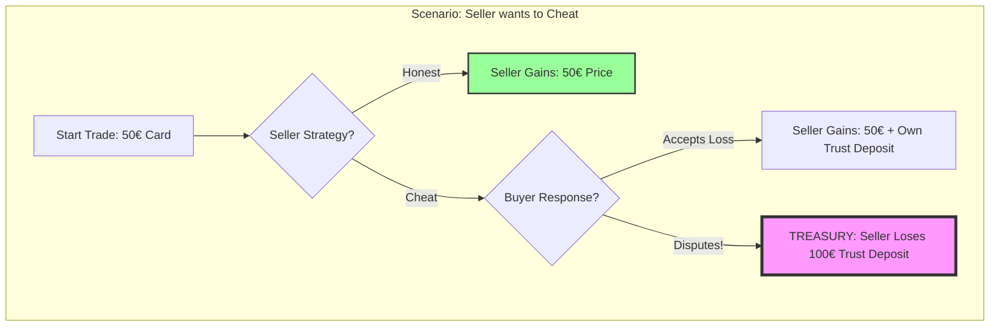
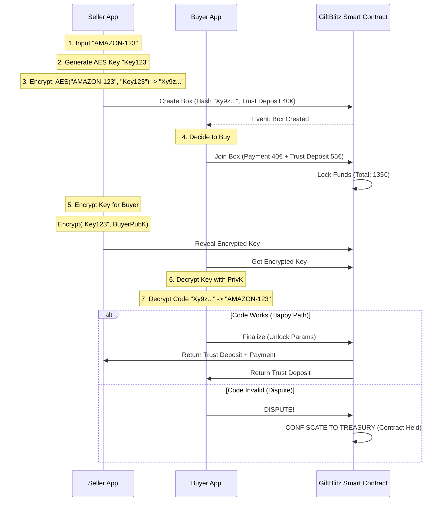

# GiftBlitz White Paper 📦🔒

> **The Trustless P2P Gift Card Exchange Protocol on IOTA**

---

## 1. Executive Summary

**GiftBlitz** is a decentralized application (dApp) that solves the fundamental lack of trust in Peer-to-Peer (P2P) gift card trading. By leveraging **IOTA Smart Contracts (ISC)** and a **Mutual Trust Deposit** model, GiftBlitz eliminates the need for middleman arbitration, video evidence, or centralized custody. It uses Game Theory to make fraud mathematically irrational, enabling a feeless, secure, and private exchange of value.

---

## 2. The Problem: The "Lemon Market" of Gift Cards

The global gift card market is valued at **$899 Billion**, yet billions are lost annually in unused balances. P2P trading offers liquidity but is plagued by a "Lemon Market" problem due to information asymmetry:

- **Buyer's Fear:** "If I pay first, the seller might disappear or give me a used code."
- **Seller's Fear:** "If I send the code, the buyer might redeem it and claim it was invalid."
- **Current Solutions Fail:** Centralized sites charge 15-30% fees. Forums/Chats are rife with scammers.

---

## 3. The Solution: Mutually Assured Destruction (MAD)

GiftBlitz replaces "Trust" with "Trust Deposit". We use a **Double Trust Deposit Escrow** system.

### 3.1 The Mechanism

1.  **Seller** deposits the Gift Card (Encrypted) + **Trust Deposit** (100% of Price).
2.  **Buyer** deposits the Payment + **Trust Deposit** (>100% of Card Value, e.g., 110%).
3.  **The Rule:** If everything goes well, everyone gets their Trust Deposit back. If there is a dispute, **BOTH** lose their Trust Deposit (Confiscated by **Protocol Treasury**).

### 3.2 Game Theory Visualization (Why Cheating Fails)

The following payoff matrix demonstrates why honest behavior is the only rational strategy (Nash Equilibrium).



- **Result:** The Seller risks losing 100€ to steal 50€. It is economically irrational.

---

## 4. Technical Architecture

Built on **IOTA** for feeless scalability and **ISC** for programmable logic.

### 4.1 Data Flow & Privacy

We use off-chain encryption to ensure the Gift Card code never touches the blockchain in plain text.



---

## 5. Reputation & Trade Caps System (Semplificato)

> 🎯 **Principio Base:** Il Trust Deposit è ASIMMETRICO. Il **Seller** mette 100% del Prezzo. Il **Buyer** mette 110% del VALORE della card. Questo rende matematicamente impossibile trarre profitto dal burning.

---

### 5.1 Le 3 Regole Fondamentali

```
┌────────────────────────────────────────────────────────────────┐
│  REGOLA 1: SELLER TRUST DEPOSIT = 100% PREZZO | BUYER TRUST DEPOSIT = 110% VALORE  │
│  REGOLA 2: TRADE CAPS crescono con i trade completati         │
│  REGOLA 3: UNA DISPUTA = RESET DEL CAP A ZERO                 │
└────────────────────────────────────────────────────────────────┘
```

---

### 5.2 Come Funziona il Trust Deposit (Esempio)

**Scenario:** Vendi una gift card Amazon da €100 al prezzo di €80

| Chi                  | Cosa Deposita          | Calcolo                                                |
| -------------------- | ---------------------- | ------------------------------------------------------ |
| **Seller**           | Trust Deposit          | 100% del Prezzo × €80 = **€80**                        |
| **Buyer**            | Prezzo + Trust Deposit | €80 + (110% del Valore × €100) = €80 + €110 = **€190** |
| **Totale in Escrow** |                        | **€270**                                               |

**Se tutto OK:**

- Seller riceve: €80 (trust deposit) + €80 (prezzo) - €0.80 (1% fee) = **€159.20**
- Buyer riceve: €110 (trust deposit) + carta da €100 = **€210 di valore**

**Se DISPUTA (Treasury):**

- Seller perde: €80 (trust deposit confiscato)
- Buyer perde: €80 (trust deposit confiscato), ma recupera €80 (prezzo) = **€0 netto**

---

### 5.3 Trade Caps (Asimmetrici Seller/Buyer)

> 🎯 **REGOLA CHIAVE:** I caps sono DIVERSI per Seller e Buyer!
>
> - **Seller:** Può vendere fino a €200 DAL GIORNO 1 (già mette 100% trust deposit)
> - **Buyer:** Caps progressivi per prevenire griefing

#### Perché Asimmetrici?

| Ruolo      | Rischio                                                     | Soluzione              |
| ---------- | ----------------------------------------------------------- | ---------------------- |
| **Seller** | Basso (già mette 100% trust deposit, perde tutto se truffa) | Nessun cap restrittivo |
| **Buyer**  | Alto (può fare false dispute = griefing)                    | Caps progressivi       |

#### Caps per SELLER (Chi Vende)

| Trade Completati | Max Valore Box | Note                |
| ---------------- | -------------- | ------------------- |
| **0+**           | **€200**       | Può vendere subito! |

> ✅ **Un nuovo utente può VENDERE una gift card da €100 dal primo giorno!**
> Il seller mette già 100% trust deposit, quindi ha già "skin in the game".

#### Caps per BUYER (Chi Compra)

| Trade Completati | Max Acquisto | Come Ci Arrivi  |
| ---------------- | ------------ | --------------- |
| **0-2**          | €30          | Primo giorno    |
| **3-6**          | €50          | Dopo 3 trade OK |
| **7-14**         | €100         | Dopo 7 trade OK |
| **15+**          | €200         | Utente veterano |

**Esempio Pratico:**

```
👤 Mario (nuovo utente, tradeCount = 0)

✅ COME SELLER: Può creare Box fino a €200
   Crea Box Amazon €100 → OK! (mette €80 trust deposit)

❌ COME BUYER: Max €30
   Vuole comprare Box da €50 → Non può ancora!
   Deve prima fare 3 trade per sbloccare €50

📦 Mario compra 3 box piccole (€20, €25, €30)
   tradeCount = 3 → Max acquisto = €50 ✨
```

---

### 5.4 Come Guadagni Trade Count

> 🎯 **IMPORTANTE: È UN SOLO CONTATORE!**
> Ogni utente ha UN UNICO `tradeCount` che cresce sia quando compri che quando vendi.
> Non esistono contatori separati per buyer e seller.

| Evento                           | Effetto       | Note                |
| -------------------------------- | ------------- | ------------------- |
| Trade completato come **Seller** | +1 trade      | Buyer ha confermato |
| Trade completato come **Buyer**  | +1 trade      | Hai confermato      |
| Box cancellata (prima del lock)  | Nessuno       | Non conta           |
| **DISPUTA (Treasury)**           | **RESET A 0** | Qualunque ruolo     |

**Esempio Pratico:**

```
👤 Mario inizia con tradeCount = 0 (max €30)

Trade 1: Mario COMPRA da Alice     → Mario: 1, Alice: +1
Trade 2: Mario VENDE a Luigi       → Mario: 2, Luigi: +1
Trade 3: Mario COMPRA da Sara      → Mario: 3 → MAX €50! ✨

Mario ha raggiunto 3 trade (2 come buyer, 1 come seller)
Ora può fare trade fino a €50!
```

> ⚠️ **ATTENZIONE:** Una singola disputa (come seller O buyer) resetta TUTTO il tuo trade count a 0. Ricomincerai da €30 max.

---

### 5.5 Soulbound NFT (Reputazione On-Chain)

Ogni utente ha un **NFT non trasferibile** che traccia la sua storia:

```solidity
struct ReputationNFT {
  address owner;           // Non puoi venderlo/trasferirlo
  uint256 totalTrades;     // Conta trade completati
  uint256 totalVolume;     // Volume totale (€)
  uint256 disputes;        // Numero di dispute (idealmente 0)
  uint256 firstTradeTime;  // Quando hai iniziato
}
```

**Perché Soulbound?**

- ❌ Non puoi comprare reputazione da altri
- ❌ Non puoi vendere un account "Pro"
- ✅ Devi guadagnartela con trade reali

---

### 5.6 Nessuna Configurazione per il Seller

> ✅ **I buyer caps sono AUTOMATICI!**
> Il seller non deve scegliere nulla. Il sistema gestisce automaticamente chi può comprare basandosi sul prezzo del Box e sul trade count del buyer.

**Esempio:**

```
Seller crea Box da €80 (valore €100)

Chi può comprare?
- Buyer con 0-2 trades → Max €30 → ❌ Non può
- Buyer con 3-6 trades → Max €50 → ❌ Non può
- Buyer con 7+ trades → Max €100 → ✅ Può comprare!
```

Questo semplifica l'UX: il seller crea il Box e basta, il sistema fa il resto.

---

### 5.7 Riepilogo Visivo

```
                    IL TUO TRADING JOURNEY

   €30 ──── €50 ──── €100 ──── €200 ──── €500
    │        │         │         │         │
    0        3         7        15        30  ← Trade completati

   ⚠️ UNA DISPUTA = TORNI QUI ──────────────┘
    (Fondi mandati al Protocol Treasury)
                                    ↓
                                   €30
```

---

### 5.8 FAQ Rapide

**Q: Se compro e vendo nella stessa transazione, guadagno 2 trade count?**

> No, ogni trade conta 1 volta per lato. Se Alice vende a Mario, Alice +1 e Mario +1.

**Q: Se l'altro utente disputa, perdo anche io il trade count?**

> Sì. La disputa resetta ENTRAMBI gli utenti coinvolti. Ecco perché disputare è costoso per tutti.

**Q: Posso fare trade con me stesso per farmare?**

> Tecnicamente sì, ma paghi 1% fee per ogni trade e sprechi tempo. Costo per arrivare a €200 cap: ~15 trades × €30 × 1% = €4.50 + tempo. Non conviene frodare.

---

## 6. NFT Visual Design (On-Chain SVG)

Each Soulbound NFT displays a dynamic badge that updates as you level up.

**Example SVG (Simplified):**

```svg
<svg width="400" height="400" xmlns="http://www.w3.org/2000/svg">
  <rect fill="#1a1a2e" width="400" height="400"/>
  <circle cx="200" cy="150" r="60" fill="#a855f7"/>
  <text x="200" y="160" fill="#fff" font-size="24" text-anchor="middle">⭐</text>
  <text x="200" y="250" fill="#fff" font-size="32" text-anchor="middle">PRO</text>
  <text x="200" y="300" fill="#888" font-size="18" text-anchor="middle">12 Trades • €520</text>
</svg>
```

**Color Scheme (basato su Trade Count):**

- **Newcomer (0-2 trades):** 🔵 Blue (#3b82f6)
- **Member (3-6 trades):** 🟢 Green (#22c55e)
- **Trusted (7-14 trades):** 🟣 Purple (#a855f7)
- **Veteran (15+ trades):** 🟡 Gold (#eab308)

---

## 7. MVP App Design (Simple & Clean)

We prioritize a "Premium" feel with dark mode, neon accents, and extreme simplicity.


---

## 8. Market Opportunity

The global unused gift card market represents a massive liquidity trap.

- **Global Market (2024):** $474 Billion (Total) -> ~$52 Billion Unused.
- **Europe:** $71-79 Billion -> ~$8 Billion Unused.
- **Italy:** ~$11-17 Billion -> **~$1.5 Billion Unused**.

GiftBlitz initially targets the **Italian Market** (1.5B€ Liquidity) where no decentralized solution exists.

## 9. Business & Revenue Model

How does the platform sustain itself?

### 8.1 Protocol Fee (Revenue)

- **Fee:** 1% on successful trades (deducted from the Seller's payout).
- **Why:** To fund development, server costs (IPFS/Gateway), and marketing.
- **Projected Revenue:** If we capture 0.1% of the Italian Unused Market (1.5M€ Volume) -> **15,000€ Revenue**.

### 8.2 Protocol Treasury (Confiscated Funds)

In the _Mutually Assured Destruction_ model, disputed funds are sent to a **Protocol Treasury** managed by the platform deployer. This ensures mathematical trust while allowing the platform to reinvest in security, maintenance, and growth.

- **Conflict of Interest:** To maintain fairness, the protocol always returns the **Price** to the buyer in case of dispute, so the platform only captures the collateral (Trust Deposits).

### 8.3 The "Anatomy of a Trade" (Who Wins?)

Here is the exact financial breakdown of a typical trade with **asymmetric trust deposit** (Seller 100% Price, Buyer 110% Value).

| Logic          | 💰 Seller (Alice)                                             | 🛍️ Buyer (Mario)                                                   | 🤖 Protocol      |
| :------------- | :------------------------------------------------------------ | :----------------------------------------------------------------- | :--------------- |
| **Asset**      | Amazon Card ($50)                                             | Needs Amazon Stuff                                                 | -                |
| **Action**     | Sells for $40                                                 | Buys for $40                                                       | Facilitates      |
| **Collateral** | Locks $40 (100% Price)                                        | Locks $55 (110% Value)                                             | Holds funds      |
| **Result**     | +$40 (Price) <br> +$40 (Trust Deposit Back) <br> -$0.40 (Fee) | -$40 (Price) <br> +$55 (Trust Deposit Back) <br> +$50 (Card Value) | +$0.40 (Fee)     |
| **NET**        | **+$39.60 Cash**                                              | **+$15.00 Value** (Paid $40 for $50 card + Trust Deposit Back)     | **+$0.40**       |
| **Safety**     | Protected by Mario's Trust Deposit ($55)                      | Protected by Alice's Trust Deposit ($40)                           | Mutually Assured |

> **Why Asymmetric Trust Deposit?** If Buyer Trust Deposit < Card Value, a scammer could profit by burning. By setting Subscriber Trust Deposit (110%) > Card Value, honesty becomes the ONLY rational choice.
