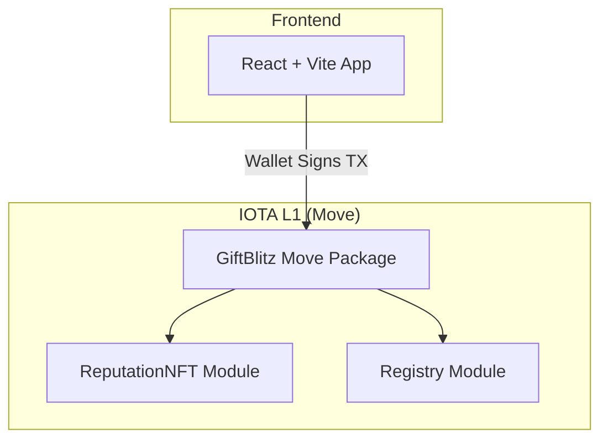

# GiftBlitz - Technical Architecture Document 📦

> **Architettura Full Decentralized per P2P Gift Card Exchange su IOTA**

---

## 1. Executive Summary

GiftBlitz è una dApp **100% decentralizzata** per lo scambio P2P di gift card su **IOTA L1** con linguaggio **Move**.

**Nessun backend server richiesto per MVP.**

| IOTA Service             | Utilizzo                              |
| ------------------------ | ------------------------------------- |
| **Move Smart Contracts** | Escrow atomico, burning, gestione Box |
| **Tokenization**         | Soulbound Reputation NFT              |
| **Notarization**         | Audit trail on-chain integrato        |

---

## 2. Architettura Full Decentralized



**Nessun backend:** Il frontend comunica direttamente con gli smart contract IOTA.

---

## 3. Technology Stack

### 3.1 Smart Contracts (On-Chain)

| Layer          | Technology           | Note                 |
| -------------- | -------------------- | -------------------- |
| **Linguaggio** | IOTA Move            | Edition 2024         |
| **CLI**        | IOTA CLI >= 1.5.0    | Build, test, publish |
| **Network**    | IOTA Testnet/Mainnet |                      |

### 3.2 Frontend

| Component      | Technology                   |
| -------------- | ---------------------------- |
| **Framework**  | React 18 + Vite              |
| **Styling**    | TailwindCSS                  |
| **Wallet**     | IOTA Wallet SDK              |
| **Encryption** | Web Crypto API (AES-256-GCM) |

---

## 4. Move Smart Contract Modules

### 4.1 `giftblitz.move` (Core Escrow)

```
📦 giftblitz
├── struct GiftBox (Shared Object)
│   ├── id, seller, buyer, card_brand
│   ├── face_value, price
│   ├── seller_stake, buyer_stake
│   ├── encrypted_code_hash, encrypted_key
│   ├── state (OPEN/LOCKED/REVEALED/COMPLETED/BURNED)
│   └── reveal_timestamp
│
├── entry fun create_box(...)
├── entry fun join_box(box, payment, stake)
├── entry fun reveal_key(box, encrypted_key)
├── entry fun finalize(box)
├── entry fun dispute(box) → BURN
├── entry fun claim_auto_finalize(box) → seller chiama dopo 24h
└── entry fun cancel_box(box) → solo se OPEN
```

### 4.2 `reputation.move` (Soulbound NFT)

```
📦 reputation
├── struct ReputationNFT (Soulbound)
│   ├── total_trades, total_volume, disputes
│
├── fun mint_if_first(ctx)
├── fun update_stats(nft, value)
├── fun reset_on_dispute(nft)
└── fun get_max_buy_value(trades) → buyer caps
```

### 4.3 `registry.move` (On-Chain Indexing)

```
📦 registry
├── struct GlobalRegistry (Shared)
│   └── boxes_by_seller, boxes_by_buyer
│
└── entry fun register_box/register_purchase
```

---

## 5. Design Decisions

### 5.1 Auto-Finalize (24h Timeout)

Dopo che il seller rivela la chiave, il buyer ha 24h per confermare o disputare.

| Opzione              | Descrizione                                    | Scelta         |
| -------------------- | ---------------------------------------------- | -------------- |
| **A) Seller chiama** | Seller chiama `claim_auto_finalize()` dopo 24h | ✅ **MVP**     |
| **B) Bounty System** | Chiunque può chiamare e prende 0.1%            | ⏳ Scalabilità |

**Rationale:** Il seller ha incentivo naturale (vuole i soldi). La UI mostra notifica "Puoi ritirare i fondi!".

---

### 5.2 Notarizzazione

| Opzione              | Descrizione                              | Pro                  | Contro          |
| -------------------- | ---------------------------------------- | -------------------- | --------------- |
| **A) Backend**       | Server Node.js notarizza                 | UX semplice          | Centralizzato   |
| **B) On-Chain pura** | Smart contract emette eventi notarizzati | Decentralizzato      | Utente paga gas |
| **C) Gas Station**   | On-chain + gas sponsorizzato             | UX + Decentralizzato | Rischio abuse   |

✅ **Scelta: Opzione B (On-Chain pura)**

Il gas su IOTA è bassissimo, quindi l'utente può pagare senza problemi. Ogni operazione critica (`finalize`, `dispute`) emette eventi che fungono da audit trail immutabile.

---

### 5.3 Query e Indexing

✅ **Scelta: IOTA GraphQL Indexer**

IOTA fornisce un indexer nativo gratuito che espone tutti gli oggetti on-chain via GraphQL API.

| Aspetto             | Dettaglio                               |
| ------------------- | --------------------------------------- |
| **Costo**           | Gratuito (infrastruttura pubblica IOTA) |
| **Endpoint**        | `https://graphql.testnet.iota.cafe`     |
| **Decentralizzato** | Parziale (puoi hostare il tuo nodo)     |

**Esempio Query - Tutti i Box Aperti:**

```graphql
query GetOpenBoxes {
  objects(filter: { type: "PACKAGE_ID::giftblitz::GiftBox" }) {
    nodes {
      address
      contents {
        json
      }
    }
  }
}
```

**Integrazione Frontend:**

```typescript
import { IotaGraphQLClient } from "@iota/iota-sdk/graphql";

const client = new IotaGraphQLClient({
  url: "https://graphql.testnet.iota.cafe",
});

async function getOpenBoxes() {
  const result = await client.query({
    objects: {
      filter: { type: `${PACKAGE_ID}::giftblitz::GiftBox` },
    },
  });
  return result.nodes.filter((box) => box.state === "OPEN");
}
```

---

## 6. Struttura Move Package

```
contracts/
├── Move.toml
├── sources/
│   ├── giftblitz.move
│   ├── reputation.move
│   └── registry.move
└── tests/
    └── giftblitz_tests.move
```

**Move.toml:**

```toml
[package]
name = "giftblitz"
version = "0.1.0"
edition = "2024"

[addresses]
giftblitz = "0x0"
iota = "0x2"
std = "0x1"

[dependencies]
Iota = { git = "https://github.com/iotaledger/iota.git", subdir = "crates/iota-framework/packages/iota-framework", rev = "framework/testnet" }
```

---

## 7. Testing Strategy

### Move Unit Tests

```bash
iota move test
```

Test cases:

- `test_create_box_success`
- `test_finalize_happy_path`
- `test_dispute_burns_both_stakes`
- `test_claim_auto_finalize_after_24h`
- `test_buyer_caps_enforced`
- `test_reputation_reset_on_dispute`

### E2E Scenarios

1. **Happy Path**: Create → Join → Reveal → Finalize
2. **Dispute Path**: Create → Join → Reveal → Dispute → BURN
3. **Timeout Path**: Create → Join → Reveal → (24h) → Seller claims

---

## 8. Development Workflow

```bash
# 1. Install IOTA CLI
# 2. Setup testnet
iota client new-env --alias testnet --rpc https://api.testnet.iota.cafe
iota client switch --env testnet
iota client faucet

# 3. Build & Test
cd contracts
iota move build
iota move test

# 4. Publish
iota client publish --gas-budget 100000000
```

---

## 9. Security

| Aspetto                | Mitigazione                              |
| ---------------------- | ---------------------------------------- |
| **Code Leak**          | Solo hash on-chain, mai codice in chiaro |
| **Reentrancy**         | Move non ha reentrancy by design         |
| **Admin Abuse**        | AdminCap solo per emergenze              |
| **Stake Manipulation** | Calcolato on-chain                       |

---

## 10. Scalabilità (Post-MVP)

| Feature                     | Soluzione                       |
| --------------------------- | ------------------------------- |
| **Query veloci**            | IOTA GraphQL Indexer            |
| **Auto-finalize garantito** | Bounty system o backend leggero |
| **UX senza gas**            | IOTA Gas Station                |

---

## 11. Riepilogo IOTA Services

```
✅ IOTA Move Smart Contracts
   └── Escrow, Shared Objects, Capabilities

✅ IOTA Tokenization
   └── Soulbound Reputation NFT

✅ IOTA Notarization (on-chain events)
   └── Audit trail integrato

⏳ IOTA Gas Station (Future)
   └── Sponsored transactions per UX migliore

⏳ Stablecoin Integration (Future V2)
   └── Supporto generico Coin<T> (USDC/EURC) per pagamenti fiat-pegged
```

---

## Next Steps

1. [x] Setup Move package (Manually Created)
2. [x] Implementare `giftblitz.move`
3. [x] Implementare `reputation.move`
4. [x] Implementare `registry.move`
5. [ ] Write Move tests
6. [ ] Deploy su Testnet
7. [ ] Collegare Frontend
