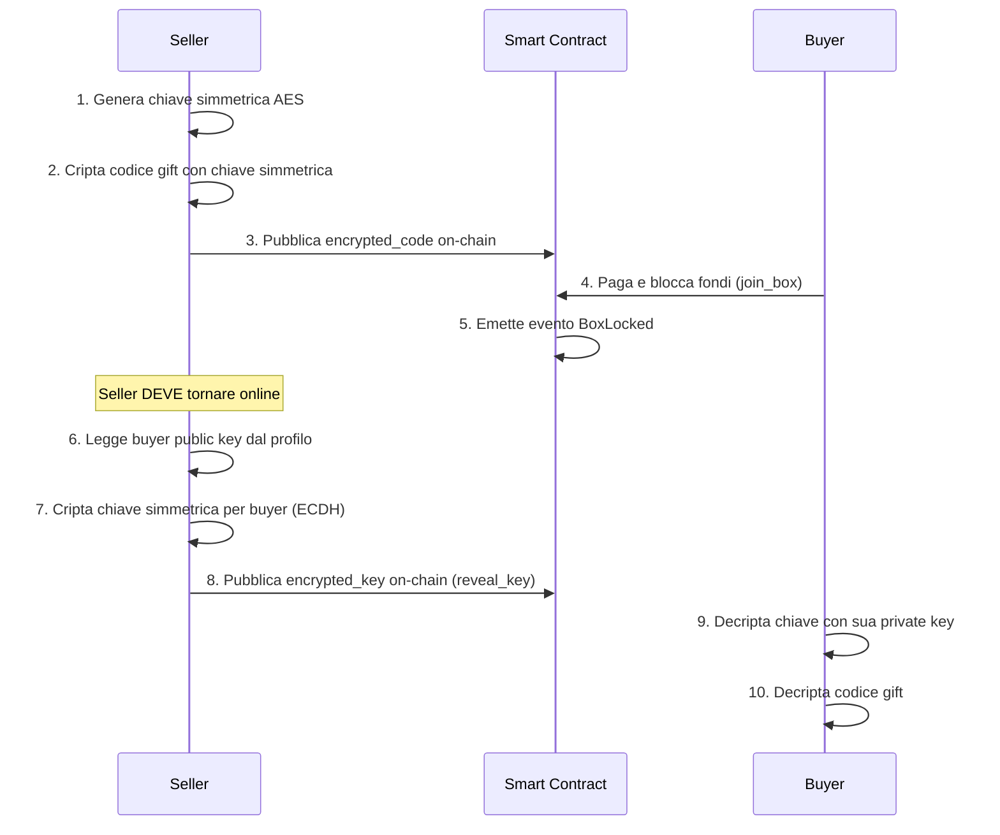

# 🔑 GiftBlitz - Analisi Soluzioni per Distribuzione Chiavi Decentralizzata

> **Obiettivo**: Trovare un modo **decentralizzato** e **automatico** per comunicare la chiave di decrittazione al buyer al momento dell'acquisto, senza dipendere da server centralizzati.

> ⚠️ **AGGIORNAMENTO CRITICO**: Dopo analisi di sicurezza, la **Soluzione 3A è INSICURA** e va **ESCLUSA**. Vedi [SECURITY_ANALYSIS_3A.md](./SECURITY_ANALYSIS_3A.md)

---

## 📋 Situazione Attuale

### Flusso Corrente (Implementato)



### ❌ Problemi Identificati

1. **Dipendenza dal Seller Online**: Il seller deve tornare online dopo l'acquisto per chiamare `reveal_key()`
2. **UX Asincrona**: Il buyer deve aspettare che il seller riveli la chiave
3. **Centralizzazione Implicita**: Se usiamo un server proxy, introduciamo un punto di centralizzazione

---

## 🎯 Requisiti della Soluzione Ideale

| Requisito              | Descrizione                                                           |
| ---------------------- | --------------------------------------------------------------------- |
| **Decentralizzato**    | Nessun server centrale che possa essere spento o censurato            |
| **Automatico**         | Al click del buyer, la chiave deve essere disponibile istantaneamente |
| **Trustless**          | Nessuno (nemmeno GiftBlitz) può leggere il codice gift                |
| **Privacy-Preserving** | Solo buyer e seller possono accedere al codice                        |
| **Compatibile IOTA**   | Deve funzionare con Move smart contracts                              |

---

## 💡 Soluzioni Possibili

### Soluzione 1: Smart Contract con Pre-Encryption

**Concetto**: Il seller cripta la chiave per il buyer **prima** che il buyer sia noto, usando un meccanismo on-chain.

#### Variante 1A: Time-Lock Encryption

```
Seller:
1. Genera chiave simmetrica K
2. Cripta codice gift con K
3. Cripta K con una "future timestamp" usando Time-Lock Encryption
4. Pubblica tutto on-chain

Buyer (al momento dell'acquisto):
1. Paga
2. Smart contract rilascia la chiave time-locked
3. Buyer decripta automaticamente (se timestamp raggiunto)
```

**Pro:**

- ✅ Completamente decentralizzato
- ✅ Automatico (nessun intervento seller)
- ✅ Trustless

**Contro:**

- ❌ Time-Lock Encryption è complesso e non nativo in Move
- ❌ Richiede librerie crittografiche avanzate (drand, threshold cryptography)
- ❌ Il timing è rigido (non flessibile per cancellazioni)

**Complessità**: 🔴 10/10 (Richiede integrazione con reti esterne come drand)

**Dipendenze Esterne**: drand network, threshold cryptography libraries

---

#### Variante 1B: Commit-Reveal con Hash Chain

```
Seller:
1. Genera chiave simmetrica K
2. Genera "reveal secret" R
3. Pubblica Hash(K || R) on-chain
4. Quando buyer paga, smart contract richiede reveal di K e R

Buyer:
1. Paga
2. Seller (o chiunque) rivela K e R
3. Smart contract verifica Hash(K || R) e rilascia
```

**Pro:**

- ✅ Relativamente semplice
- ✅ Verificabile on-chain

**Contro:**

- ❌ **Ancora richiede che qualcuno chiami reveal** (non automatico)
- ❌ Non risolve il problema della dipendenza dal seller online

**Complessità**: 🟡 5/10

**Verdict**: ❌ Non risolve il problema principale

---

### Soluzione 2: Proxy Re-Encryption (PRE) ✅ RACCOMANDATA

**Concetto**: Usare crittografia PRE per delegare il potere di trasformare la chiave a un proxy "cieco".

#### Variante 2A: Proxy Centralizzato (MVP) ✅

```
Seller:
1. Genera Capsule (codice criptato per sé stesso)
2. Genera KFrags (deleghe matematiche)
3. Invia KFrags al Proxy Server
4. Pubblica Capsule on-chain

Buyer:
1. Paga
2. Proxy Server monitora blockchain
3. Proxy usa KFrags per trasformare Capsule per buyer
4. Buyer decripta con sua chiave privata
```

**Pro:**

- ✅ **UX istantanea** (2-3 secondi)
- ✅ **Matematicamente sicuro** (solo buyer può decriptare)
- ✅ **Proxy è "cieco"** (non può leggere il codice)
- ✅ **Implementazione esistente** (umbral-js)

**Contro:**

- ⚠️ **Proxy è un punto di centralizzazione** (può andare offline)
- ⚠️ Richiede fiducia che il proxy esegua la re-encryption (ma non può rubare)

**Complessità**: 🟡 7/10

**Dipendenze Esterne**: Proxy server (gestito da GiftBlitz o partner)

**Costi**: Server leggero (~$10-20/mese)

**Sicurezza**: ✅ Matematicamente garantita (threshold cryptography)

---

#### Variante 2B: Proxy Decentralizzato (Threshold Network)

```
Seller:
1. Genera Capsule
2. Genera KFrags (split tra N nodi)
3. Distribuisce KFrags a rete decentralizzata (es. NuCypher, Lit Protocol)

Buyer:
1. Paga
2. Rete di nodi monitora blockchain
3. M-of-N nodi collaborano per re-encryption
4. Buyer decripta
```

**Pro:**

- ✅ Completamente decentralizzato
- ✅ Fault-tolerant (alcuni nodi possono essere offline)
- ✅ Trustless (threshold cryptography)

**Contro:**

- ❌ **Dipendenza da rete esterna** (NuCypher, Lit Protocol)
- ❌ Costi di rete (fee per ogni re-encryption)
- ❌ Latenza potenzialmente più alta
- ❌ Complessità di integrazione elevata

**Complessità**: 🔴 9/10

**Dipendenze Esterne**: NuCypher Mainnet o Lit Protocol

**Costi**: $0.10-$1 per re-encryption (variabile)

---

### Soluzione 3: Smart Contract Custom con Escrow di Chiavi ❌ INSICURA

**Concetto**: Creare un contratto Move custom che gestisce la distribuzione delle chiavi in modo trustless.

#### Variante 3A: On-Chain Key Escrow ❌ SCARTATA

> ⚠️ **ATTENZIONE**: Questa soluzione è **INSICURA** e va **ESCLUSA**.

**Flusso:**

```
Seller:
1. Genera chiave simmetrica K
2. Deriva password P = Hash(box_id || seller_secret)
3. Cripta K con P → encrypted_key_for_anyone
4. Pubblica encrypted_key_for_anyone on-chain
5. Pubblica seller_secret on-chain (in evento o campo)

Buyer:
1. Paga
2. Smart contract emette evento con seller_secret
3. Buyer ricostruisce P = Hash(box_id || seller_secret)
4. Buyer decripta encrypted_key_for_anyone con P
5. Buyer usa K per decriptare codice gift
```

**❌ VULNERABILITÀ CRITICA:**

Una volta che `seller_secret` è pubblico (dopo il pagamento), **CHIUNQUE** può:

1. Leggere `seller_secret` dalla blockchain
2. Calcolare `P = Hash(box_id || seller_secret)`
3. Decriptare `encrypted_key_for_anyone`
4. Decriptare il codice gift
5. **RUBARE IL CODICE**

**Verdict**: ❌ **INSICURA - DA ESCLUDERE COMPLETAMENTE**

Vedi [SECURITY_ANALYSIS_3A.md](./SECURITY_ANALYSIS_3A.md) per analisi dettagliata degli scenari di attacco.

---

### Soluzione 4: Hybrid - Pre-Encryption + Fallback Manuale

**Concetto**: Combinare un meccanismo automatico (best effort) con fallback manuale.

```
Seller:
1. Cripta codice con chiave simmetrica K
2. Genera KFrags per PRE
3. Invia KFrags a proxy (se disponibile)
4. Pubblica Capsule on-chain

Buyer:
1. Paga
2. TENTATIVO 1: Proxy re-encryption (se disponibile) → Istantaneo
3. FALLBACK: Aspetta reveal manuale del seller → Tradizionale

Frontend mostra:
- ⚡ "Decrypting automatically..." (se proxy funziona)
- ⏳ "Waiting for seller to reveal key..." (se proxy offline)
```

**Pro:**

- ✅ Massima resilienza (sempre funziona)
- ✅ UX ottimale quando proxy è online
- ✅ Degrada gracefully

**Contro:**

- ⚠️ Complessità di implementazione (2 percorsi)
- ⚠️ UX inconsistente (a volte veloce, a volte lenta)

**Complessità**: 🟡 6/10

---

### Soluzione 5: IOTA Identity + Verifiable Credentials

**Concetto**: Usare IOTA Identity per gestire chiavi crittografiche come Verifiable Credentials.

**Contro:**

- ❌ **IOTA Identity non è progettato per questo use case**
- ❌ Overhead di complessità
- ❌ Richiede che buyer abbia IOTA Identity wallet

**Complessità**: 🔴 8/10

**Verdict**: ❌ Overkill per questo use case

---

### Soluzione 6: Blockchain Events + IPFS

**Concetto**: Usare eventi blockchain per triggerare upload automatico su IPFS.

**Contro:**

- ❌ **Richiede ancora un servizio che monitora** (non automatico)
- ❌ Latenza IPFS (potenzialmente lenta)
- ❌ Complessità di gestione CID

**Complessità**: 🟡 7/10

**Verdict**: ⚠️ Simile a Proxy ma più complesso

---

## 📊 Tabella Comparativa

| Soluzione                     | Sicura? | Decentralizzato | Automatico | Complessità | Costi       | Raccomandazione         |
| ----------------------------- | ------- | --------------- | ---------- | ----------- | ----------- | ----------------------- |
| **Sistema Attuale (P2P)**     | ✅      | ✅              | ❌         | 🟢 Fatto    | Gratis      | ⚠️ Funziona ma UX lenta |
| **1A: Time-Lock**             | ✅      | ✅              | ✅         | 🔴 10/10    | Gratis      | ❌ Troppo complesso     |
| **1B: Commit-Reveal**         | ✅      | ✅              | ❌         | 🟡 5/10     | Gratis      | ❌ Non automatico       |
| **2A: Proxy Centralizzato**   | ✅      | ⚠️              | ✅         | 🟡 7/10     | $10-20/mese | ✅ **MIGLIORE per MVP** |
| **2B: Proxy Decentralizzato** | ✅      | ✅              | ✅         | 🔴 9/10     | $0.10-1/tx  | ⏳ Futuro               |
| **3A: On-Chain Escrow**       | ❌      | ✅              | ✅         | 🟢 4/10     | Gratis      | ❌ **INSICURA**         |
| **4: Hybrid**                 | ✅      | ⚠️              | ✅         | 🟡 6/10     | Variabile   | ⚠️ Opzione valida       |
| **5: IOTA Identity**          | ✅      | ✅              | ⚠️         | 🔴 8/10     | Gratis      | ❌ Overkill             |
| **6: IPFS Events**            | ✅      | ✅              | ⚠️         | 🟡 7/10     | Gratis      | ❌ Troppo complesso     |

---

## 🎯 Raccomandazioni Finali

### ✅ Per MVP / Hackathon: Soluzione 2A (Proxy Re-Encryption Centralizzato)

**Perché è l'unica scelta valida:**

1. ✅ **Matematicamente sicura** (solo buyer con private key può decriptare)
2. ✅ **Automatico al 100%** (istantaneo, 2-3 secondi dopo pagamento)
3. ✅ **Implementabile** (3-5 giorni con umbral-js)
4. ✅ **UX perfetta** (nessuna attesa per il buyer)
5. ✅ **Narrativa forte** (crittografia avanzata PRE per hackathon)
6. ✅ **Proxy è "cieco"** (matematicamente impossibile per proxy leggere i codici)

**Trade-off Accettabile:**

- Il Proxy è centralizzato ma matematicamente "cieco" (non può leggere i codici)
- Costi operativi minimi ($10-20/mese per server leggero)
- Può evolvere verso soluzione decentralizzata (2B) in futuro

**Implementazione Dettagliata**: Vedi [SECURITY_ANALYSIS_3A.md](./SECURITY_ANALYSIS_3A.md) sezione "Implementazione Soluzione 2A (Sicura)"

---

### ⏳ Per Produzione (Lungo Termine): Soluzione 2B (Proxy Decentralizzato)

**Roadmap di Evoluzione:**

1. **Phase 1 (MVP)**: Proxy centralizzato (Soluzione 2A)
2. **Phase 2**: Proxy federato (3-5 nodi gestiti da partner fidati)
3. **Phase 3**: Migra a rete decentralizzata completa (Lit Protocol o NuCypher)

---

## 🚀 Next Steps - Implementazione Soluzione 2A

### 1. Smart Contract (giftblitz.move)

```move
public struct GiftBox has key, store {
    // ... campi esistenti ...

    // PRE fields
    capsule: vector<u8>,           // Codice criptato per seller
    kfrag_ids: vector<vector<u8>>, // IDs dei KFrags (stored off-chain nel proxy)
}

public entry fun create_box(
    // ... parametri esistenti ...
    capsule: vector<u8>,
    kfrag_ids: vector<vector<u8>>,
) {
    // Seller pubblica Capsule e KFrag IDs
}

public entry fun join_box(...) {
    // ... logica esistente ...

    // Emetti evento con buyer public key
    iota::event::emit(BoxLocked {
        id: object::id_address(box),
        buyer: buyer_addr,
        buyer_public_key: buyer_pub_key  // ← NUOVO
    });
}
```

### 2. Frontend (security.ts)

```typescript
import {
  Alice,
  Bob,
  encrypt,
  generateKFrags,
  reencrypt,
} from "@nucypher/umbral-js";

// Seller: Create Box
export async function createBoxWithPRE(giftCode: string) {
  const alice = Alice.fromSecretKey(sellerSecretKey);
  const { capsule, ciphertext } = encrypt(
    alice.publicKey,
    Buffer.from(giftCode),
  );
  const kfrags = generateKFrags(
    alice.secretKey,
    alice.publicKey,
    alice.publicKey,
    1,
    1,
  );
  const kfragIds = await uploadKFragsToProxy(kfrags);

  return {
    capsule: Array.from(capsule.toBytes()),
    ciphertext: Array.from(ciphertext),
    kfragIds,
  };
}

// Buyer: Decrypt after purchase
export async function decryptWithPRE(
  capsule: Uint8Array,
  ciphertext: Uint8Array,
) {
  const bob = Bob.fromSecretKey(buyerSecretKey);
  const reencryptedCapsule = await requestReencryption(boxId, bob.publicKey);
  const plaintext = decrypt(bob.secretKey, reencryptedCapsule, ciphertext);
  return plaintext.toString();
}
```

### 3. Proxy Server (proxy/server.js)

```javascript
const { IotaClient } = require("@iota/iota-sdk");
const { reencrypt } = require("@nucypher/umbral-js");

async function monitorBoxLocked() {
  const client = new IotaClient({ url: IOTA_RPC_URL });
  const subscription = await client.subscribeEvent({
    filter: { MoveEventType: `${PACKAGE_ID}::giftblitz::BoxLocked` },
  });

  subscription.on("message", async (event) => {
    const { id: boxId, buyer, buyer_public_key } = event.parsedJson;
    const kfrags = await getKFragsForBox(boxId);
    const buyerPubKey = PublicKey.fromBytes(buyer_public_key);
    const reencryptedCapsule = reencrypt(capsule, kfrags, buyerPubKey);
    await storeReencryptedCapsule(boxId, reencryptedCapsule);
    console.log(`✅ Re-encrypted box ${boxId} for buyer ${buyer}`);
  });
}
```

### 4. Checklist Implementazione

- [ ] Installare `@nucypher/umbral-js` nel frontend (`npm install @nucypher/umbral-js`)
- [ ] Modificare `giftblitz.move` per supportare `capsule` e `kfrag_ids`
- [ ] Creare cartella `proxy/` con server Node.js
- [ ] Implementare monitoring eventi IOTA nel proxy
- [ ] Implementare storage KFrags (database o file system)
- [ ] Implementare re-encryption automatica
- [ ] Aggiornare frontend per usare PRE invece di ECDH
- [ ] Testing end-to-end del flusso completo
- [ ] Deploy proxy su server (AWS/GCP/Vercel)

**Tempo Stimato**: 3-5 giorni di sviluppo

---

## ❌ Soluzioni da ESCLUDERE

| Soluzione               | Motivo Esclusione                                                           |
| ----------------------- | --------------------------------------------------------------------------- |
| **3A: On-Chain Escrow** | ❌ **INSICURA** - Chiunque può decriptare dopo che seller_secret è pubblico |
| **3B: Dual-Key**        | ❌ **INSICURA** - Stesso problema di 3A                                     |
| **1B: Commit-Reveal**   | ❌ Non automatico (richiede intervento seller)                              |
| **5: IOTA Identity**    | ❌ Overkill, non progettato per questo use case                             |
| **6: IPFS Events**      | ❌ Richiede servizio di monitoring (simile a proxy ma più complesso)        |

---

## ❓ Domande per Decisione Finale

1. **Sei d'accordo con Soluzione 2A** (Proxy PRE) come migliore compromesso sicurezza/implementabilità?

2. **Budget**: Sei disposto a pagare $10-20/mese per un server proxy leggero?

3. **Timeline**: Abbiamo 3-5 giorni per implementare la soluzione PRE?

4. **Hackathon Narrative**: La storia "Crittografia avanzata PRE, matematicamente sicuro" è forte per la giuria?

5. **Alternativa**: Se non vuoi implementare PRE, possiamo mantenere il sistema attuale (P2P manuale) e migliorare la UX con notifiche migliori?

---

## 📝 Conclusione

Dopo aver analizzato tutte le opzioni e scartato le soluzioni insicure (3A, 3B), la **Soluzione 2A (Proxy Re-Encryption Centralizzato)** è l'unica che soddisfa tutti i requisiti:

- ✅ **Sicura**: Matematicamente garantito che solo buyer può decriptare
- ✅ **Automatica**: Istantanea (2-3 secondi)
- ✅ **Implementabile**: 3-5 giorni con librerie esistenti
- ✅ **Scalabile**: Può evolvere verso decentralizzazione (2B)

**Alternative sicure ma non automatiche:**

- Sistema attuale (P2P manuale) - Sicuro ma richiede seller online
- Time-Lock Encryption (1A) - Sicuro ma complessità 10/10

**La mia raccomandazione finale: Soluzione 2A (Proxy PRE) per MVP, poi evolvi verso 2B (Decentralizzato) in produzione.**
