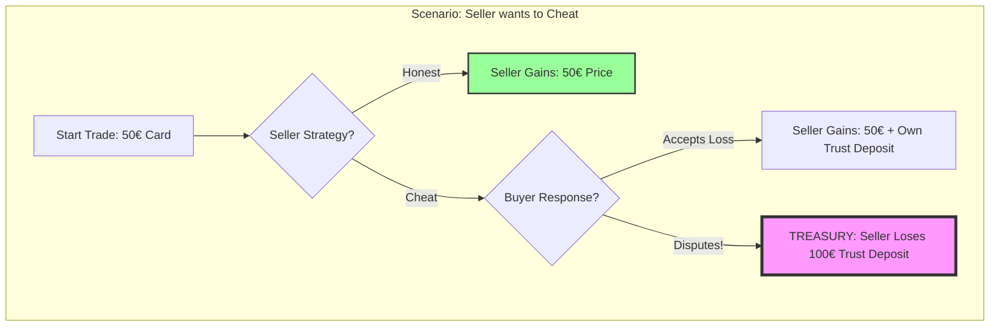
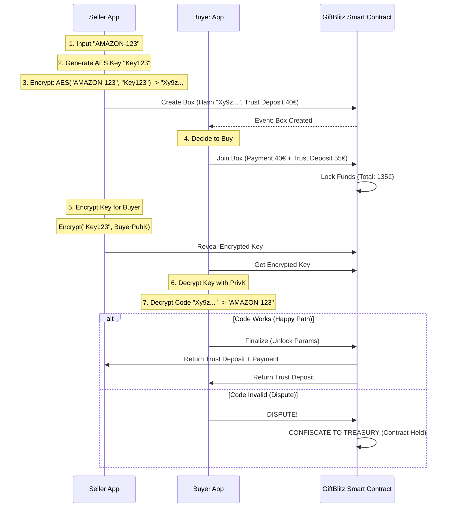

# GiftBlitz White Paper 📦🔒

> **The Trustless P2P Gift Card Exchange Protocol on IOTA**

---

## 1. Executive Summary

**GiftBlitz** is a decentralized application (dApp) that solves the fundamental lack of trust in Peer-to-Peer (P2P) gift card trading. By leveraging **IOTA Smart Contracts (ISC)** and a **Mutual Trust Deposit** model, GiftBlitz eliminates the need for middleman arbitration, video evidence, or centralized custody. It uses Game Theory to make fraud mathematically irrational, enabling a feeless, secure, and private exchange of value.

---

## 2. The Problem: The "Lemon Market" of Gift Cards

The global gift card market is valued at **$899 Billion**, yet billions are lost annually in unused balances. P2P trading offers liquidity but is plagued by a "Lemon Market" problem due to information asymmetry:

- **Buyer's Fear:** "If I pay first, the seller might disappear or give me a used code."
- **Seller's Fear:** "If I send the code, the buyer might redeem it and claim it was invalid."
- **Current Solutions Fail:** Centralized sites charge 15-30% fees. Forums/Chats are rife with scammers.

---

## 3. The Solution: Mutually Assured Destruction (MAD)

GiftBlitz replaces "Trust" with "Trust Deposit". We use a **Double Trust Deposit Escrow** system.

### 3.1 The Mechanism

1.  **Seller** deposits the Gift Card (Encrypted) + **Trust Deposit** (100% of Card Face Value).
2.  **Buyer** deposits the Payment + **Trust Deposit** (>100% of Card Value, e.g., 110%).
3.  **The Rule:** If everything goes well, everyone gets their Trust Deposit back. If there is a dispute, **BOTH** lose their Trust Deposit (Confiscated by **Protocol Treasury**).

### 3.2 Game Theory Visualization (Why Cheating Fails)

The following payoff matrix demonstrates why honest behavior is the only rational strategy (Nash Equilibrium).



- **Result:** The Seller risks losing 100€ to steal 50€. It is economically irrational.

---

## 4. Technical Architecture

Built on **IOTA** for feeless scalability and **ISC** for programmable logic.

### 4.1 Data Flow & Privacy

We use off-chain encryption to ensure the Gift Card code never touches the blockchain in plain text.



---

## 5. Reputation & Trade Caps System (Simplified)

> 🎯 **Core Principle:** The Trust Deposit is ASYMMETRIC. The **Seller** puts 100% of the Price. The **Buyer** puts 110% of the card VALUE. This makes it mathematically impossible to profit from burning.

---

### 5.1 The 3 Fundamental Rules

```
┌────────────────────────────────────────────────────────────────┐
│  RULE 1: SELLER TRUST DEPOSIT = 100% FACE VALUE | BUYER TRUST DEPOSIT = 110% VALUE  │
│  RULE 2: TRADE CAPS grow with completed trades                │
│  RULE 3: ONE DISPUTE = CAP RESET TO ZERO                      │
└────────────────────────────────────────────────────────────────┘
```

---

### 5.2 How Trust Deposit Works (Example)

**Scenario:** Sell a €100 Amazon gift card for €80

| Who                 | What They Deposit     | Calculation                                          |
| ------------------- | --------------------- | ---------------------------------------------------- |
| **Seller**          | Trust Deposit         | 100% of Card Value × €100 = **€100**                 |
| **Buyer**           | Price + Trust Deposit | €80 + (110% of Value × €100) = €80 + €110 = **€190** |
| **Total in Escrow** |                       | **€290**                                             |

**If everything is OK:**

- Seller receives: €100 (trust deposit) + €80 (price) - €0.80 (1% fee) = **€179.20**
- Buyer receives: €110 (trust deposit) + €100 card = **€210 in value**

**If DISPUTE (Treasury):**

- Seller loses: €80 (trust deposit confiscated)
- Buyer loses: €80 (trust deposit confiscated), but recovers €80 (price) = **€0 net**

---

### 5.3 Trade Caps (Asymmetric Seller/Buyer)

> 🎯 **KEY RULE:** Caps are DIFFERENT for Sellers and Buyers!
>
> - **Seller:** Can sell up to €200 FROM DAY 1 (already puts 100% trust deposit)
> - **Buyer:** Progressive caps to prevent griefing

#### Why Asymmetric?

| Role       | Risk                                                         | Solution           |
| ---------- | ------------------------------------------------------------ | ------------------ |
| **Seller** | Low (already puts 100% trust deposit, loses all if scamming) | No restrictive cap |
| **Buyer**  | High (can make false disputes = griefing)                    | Progressive caps   |

#### Caps for SELLER (Who Sells)

| Completed Trades | Max Box Value | Notes                 |
| ---------------- | ------------- | --------------------- |
| **0+**           | **€200**      | Can sell immediately! |

> ✅ **A new user can SELL a €100 gift card from day one!**
> The seller already puts 100% trust deposit, so they have "skin in the game".

#### Caps for BUYER (Who Buys)

| Completed Trades   | Max Purchase | How to Get There  |
| ------------------ | ------------ | ----------------- |
| **Newcomer (0-2)** | €30          | First day         |
| **Verified (3-6)** | €50          | After 3 OK trades |
| **Pro (7-14)**     | €100         | After 7 OK trades |
| **Veteran (15+)**  | €200         | Veteran user      |

**Practical Example:**

```
👤 Mario (new user, tradeCount = 0)

✅ AS SELLER: Can create Box up to €200
   Creates Amazon €100 Box → OK! (puts €80 trust deposit)

❌ AS BUYER: Max €30
   Wants to buy €50 Box → Cannot yet!
   Must do 3 trades first to unlock €50

📦 Mario buys 3 small boxes (€20, €25, €30)
   tradeCount = 3 → Max purchase = €50 ✨
```

---

### 5.4 How to Earn Trade Count

> 🎯 **IMPORTANT: IT'S A SINGLE COUNTER!**
> Each user has ONE SINGLE `tradeCount` that grows both when buying and when selling.
> There are no separate counters for buyers and sellers.

| Event                         | Effect         | Notes           |
| ----------------------------- | -------------- | --------------- |
| Trade completed as **Seller** | +1 trade       | Buyer confirmed |
| Trade completed as **Buyer**  | +1 trade       | You confirmed   |
| Box cancelled (before lock)   | None           | Doesn't count   |
| **DISPUTE (Treasury)**        | **RESET TO 0** | Any role        |

**Practical Example:**

```
👤 Mario starts with tradeCount = 0 (max €30)

Trade 1: Mario BUYS from Alice     → Mario: 1, Alice: +1
Trade 2: Mario SELLS to Luigi      → Mario: 2, Luigi: +1
Trade 3: Mario BUYS from Sara      → Mario: 3 → MAX €50! ✨

Mario reached 3 trades (2 as buyer, 1 as seller)
Now he can trade up to €50!
```

> ⚠️ **WARNING:** A single dispute (as seller OR buyer) resets ALL your trade count to 0. You will start over from €30 max.

---

### 5.5 Soulbound NFT (On-Chain Reputation)

Each user has a **non-transferable NFT** that tracks their history:

```solidity
struct ReputationNFT {
  address owner;           // Cannot sell/transfer
  uint256 totalTrades;     // Counts completed trades
  uint256 totalVolume;     // Total volume (€)
  uint256 disputes;        // Number of disputes (ideally 0)
  uint256 firstTradeTime;  // When you started
}
```

**Why Soulbound?**

- ❌ You cannot buy reputation from others
- ❌ You cannot sell a "Pro" account
- ✅ You must earn it with real trades

---

### 5.6 No Configuration for Seller

> ✅ **Buyer caps are AUTOMATIC!**
> The seller doesn't have to choose anything. The system automatically manages who can buy based on Box price and buyer's trade count.

**Example:**

```
Seller creates €80 Box (€100 value)

Who can buy?
- Buyer with 0-2 trades → Max €30 → ❌ Cannot
- Buyer with 3-6 trades → Max €50 → ❌ Cannot
- Buyer with 7+ trades → Max €100 → ✅ Can buy!
```

This simplifies UX: the seller creates the Box and that's it, the system does the rest.

---

### 5.7 Visual Summary

```
                    YOUR TRADING JOURNEY

   €30 ──── €50 ──── €100 ──── €200 ──── €500
    │        │         │         │         │
    0        3         7        15        30  ← Completed Trades

   ⚠️ ONE DISPUTE = BACK TO START ──────────┘
    (Funds sent to Protocol Treasury)
                                    ↓
                                   €30
```

---

### 5.8 Quick FAQ

**Q: If I buy and sell in the same transaction, do I gain 2 trade counts?**

> No, each trade counts once per side. If Alice sells to Mario, Alice +1 and Mario +1.

**Q: If the other user disputes, do I lose my trade count too?**

> Yes. A dispute resets BOTH involved users. This is why disputing is costly for everyone.

**Q: Can I trade with myself to farm?**

> Technically yes, but you pay 1% fee for each trade and waste time. Cost to reach €200 cap: ~15 trades × €30 × 1% = €4.50 + time. Not worth frauding.

---

## 6. NFT Visual Design (On-Chain SVG)

Each Soulbound NFT displays a dynamic badge that updates as you level up.

**Example SVG (Simplified):**

```svg
<svg width="400" height="400" xmlns="http://www.w3.org/2000/svg">
  <rect fill="#1a1a2e" width="400" height="400"/>
  <circle cx="200" cy="150" r="60" fill="#a855f7"/>
  <text x="200" y="160" fill="#fff" font-size="24" text-anchor="middle">⭐</text>
  <text x="200" y="250" fill="#fff" font-size="32" text-anchor="middle">PRO</text>
  <text x="200" y="300" fill="#888" font-size="18" text-anchor="middle">12 Trades • €520</text>
</svg>
```

**Color Scheme (based on Trade Count):**

- **Newcomer (0-2 trades):** 🔵 Blue (#3b82f6)
- **Verified (3-6 trades):** 🟢 Cyan (#06b6d4)
- **Pro (7-14 trades):** 🟣 Indigo (#6366f1)
- **Veteran (15+ trades):** 🟡 Purple (#a855f7)

---

## 7. MVP App Design (Simple & Clean)

We prioritize a "Premium" feel with dark mode, neon accents, and extreme simplicity.


---

## 8. Market Opportunity

The global unused gift card market represents a massive liquidity trap.

- **Global Market (2024):** $474 Billion (Total) -> ~$52 Billion Unused.
- **Europe:** $71-79 Billion -> ~$8 Billion Unused.
- **Italy:** ~$11-17 Billion -> **~$1.5 Billion Unused**.

GiftBlitz initially targets the **Italian Market** (1.5B€ Liquidity) where no decentralized solution exists.

## 9. Business & Revenue Model

How does the platform sustain itself?

### 8.1 Protocol Fee (Revenue)

- **Fee:** 1% on successful trades (deducted from the Seller's payout).
- **Why:** To fund development, server costs (IPFS/Gateway), and marketing.
- **Projected Revenue:** If we capture 0.1% of the Italian Unused Market (1.5M€ Volume) -> **15,000€ Revenue**.

### 8.2 Protocol Treasury (Confiscated Funds)

In the _Mutually Assured Destruction_ model, disputed funds are sent to a **Protocol Treasury** managed by the platform deployer. This ensures mathematical trust while allowing the platform to reinvest in security, maintenance, and growth.

- **Conflict of Interest:** To maintain fairness, the protocol always returns the **Price** to the buyer in case of dispute, so the platform only captures the collateral (Trust Deposits).

### 8.3 The "Anatomy of a Trade" (Who Wins?)

Here is the exact financial breakdown of a typical trade with **asymmetric trust deposit** (Seller 100% Face Value, Buyer 110% Value).

| Logic          | 💰 Seller (Alice)                                             | 🛍️ Buyer (Mario)                                                   | 🤖 Protocol      |
| :------------- | :------------------------------------------------------------ | :----------------------------------------------------------------- | :--------------- |
| **Asset**      | Amazon Card ($50)                                             | Needs Amazon Stuff                                                 | -                |
| **Action**     | Sells for $40                                                 | Buys for $40                                                       | Facilitates      |
| **Collateral** | Locks $50 (100% Value)                                        | Locks $55 (110% Value)                                             | Holds funds      |
| **Result**     | +$40 (Price) <br> +$50 (Trust Deposit Back) <br> -$0.40 (Fee) | -$40 (Price) <br> +$55 (Trust Deposit Back) <br> +$50 (Card Value) | +$0.40 (Fee)     |
| **NET**        | **+$39.60 Cash**                                              | **+$15.00 Value** (Paid $40 for $50 card + Trust Deposit Back)     | **+$0.40**       |
| **Safety**     | Protected by Mario's Trust Deposit ($55)                      | Protected by Alice's Trust Deposit ($50)                           | Mutually Assured |

> **Why Asymmetric Trust Deposit?** If Buyer Trust Deposit < Card Value, a scammer could profit by burning. By setting Subscriber Trust Deposit (110%) > Card Value, honesty becomes the ONLY rational choice.
> **Why Seller 100% Face Value?** Ensures that "double-spending" results in a net loss (Alice loses $50 deposit to gain <$50 elsewhere), making fraud irrational.
