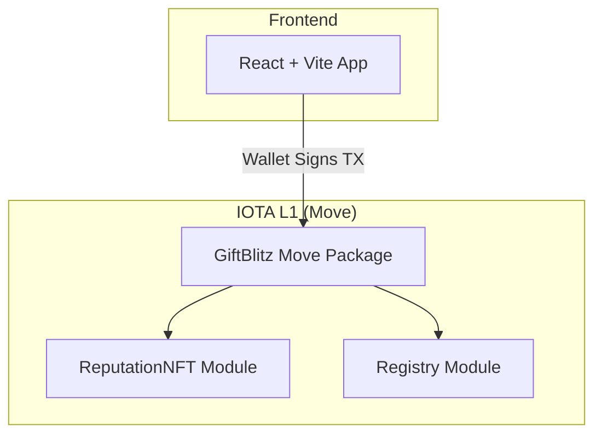

# GiftBlitz - Technical Architecture Document 📦

> **Full Decentralized Architecture for P2P Gift Card Exchange on IOTA**

---

## 1. Executive Summary

GiftBlitz is a **100% decentralized** dApp for P2P gift card exchange on **IOTA L1** with **Move** language.

**No backend server required for MVP.**

| IOTA Service             | Usage                                 |
| ------------------------ | ------------------------------------- |
| **Move Smart Contracts** | Atomic escrow, burning, Box management|
| **Tokenization**         | Soulbound Reputation NFT              |
| **Notarization**         | Integrated on-chain audit trail       |

---

## 2. Full Decentralized Architecture



**No backend:** The frontend communicates directly with IOTA smart contracts.

---

## 3. Technology Stack

### 3.1 Smart Contracts (On-Chain)

| Layer          | Technology           | Notes                |
| -------------- | -------------------- | -------------------- |
| **Language**   | IOTA Move            | Edition 2024         |
| **CLI**        | IOTA CLI >= 1.5.0    | Build, test, publish |
| **Network**    | IOTA Testnet/Mainnet |                      |

### 3.2 Frontend

| Component      | Technology                   |
| -------------- | ---------------------------- |
| **Framework**  | React 18 + Vite              |
| **Styling**    | TailwindCSS                  |
| **Wallet**     | IOTA Wallet SDK              |
| **Encryption** | Web Crypto API (AES-256-GCM) |

---

## 4. Move Smart Contract Modules

### 4.1 `giftblitz.move` (Core Escrow)

```
📦 giftblitz
├── struct GiftBox (Shared Object)
│   ├── id, seller, buyer, card_brand
│   ├── face_value, price
│   ├── seller_stake, buyer_stake
│   ├── encrypted_code_hash, encrypted_key
│   ├── state (OPEN/LOCKED/REVEALED/COMPLETED/BURNED/EXPIRED)
│   ├── created_at
│   ├── locked_at (NEW: purchase timestamp)
│   └── reveal_timestamp
│
├── entry fun create_box(...)
├── entry fun join_box(box, payment, stake)
├── entry fun reveal_key(box, encrypted_key)
├── entry fun finalize(box)
├── entry fun dispute(box) → BURN
├── entry fun claim_auto_finalize(box) → 72h after reveal
├── entry fun claim_reveal_timeout(box) → 72h after lock (if no reveal)
└── entry fun cancel_box(box) → only if OPEN
```

### 4.2 `reputation.move` (Soulbound NFT)

```
📦 reputation
├── struct ReputationNFT (Soulbound)
│   ├── total_trades, total_volume, disputes
│
├── fun mint_if_first(ctx)
├── fun update_stats(nft, value)
├── fun reset_on_dispute(nft)
└── fun get_max_buy_value(trades) → buyer caps
```

````

> **Note:** On-chain indexing via `registry.move` is no longer used. We use **IOTA GraphQL Indexer** for querying boxes (see section 5.3).

---

## 5. Design Decisions

### 5.1 Timeouts & Auto-Finalize (Double Timeout)

To protect both buyer and seller from ghosting, we use two symmetric timeouts of **72 hours**.

#### A) Reveal Timeout (72h after purchase)

If the seller does not reveal the key within 72h of lock (purchase):

- Buyer calls `claim_reveal_timeout()`
- Buyer recovers everything (payment + stake)
- **Compensation**: Buyer receives 50% of seller's stake
- **BURN**: The remaining 50% of seller's stake is burned

#### B) Auto-Finalize (72h after reveal)

If the buyer does not confirm nor dispute within 72h of key reveal:

- Anyone (usually the seller) can call `claim_auto_finalize()`
- The system assumes the transaction is valid (silence means consent)
- Seller receives payment and stakes are unlocked

**Rationale:**

- **Symmetry**: Both have 3 days.
- **Buyer Protection**: Compensated if seller disappears.
- **Seller Protection**: Paid if buyer forgets to confirm.

---

### 5.2 Notarization

| Option               | Description                              | Pros                 | Cons            |
| -------------------- | ---------------------------------------- | -------------------- | --------------- |
| **A) Backend**       | Node.js server notarizes                 | Simple UX            | Centralized     |
| **B) Pure On-Chain** | Smart contract emits notarized events    | Decentralized        | User pays gas   |
| **C) Gas Station**   | On-chain + sponsored gas                 | UX + Decentralized   | Abuse risk      |

✅ **Choice: Option B (Pure On-Chain)**

Gas on IOTA is extremely low, so the user can pay without issues. Every critical operation (`finalize`, `dispute`) emits events that serve as an immutable audit trail.

---

### 5.3 Queries and Indexing

✅ **Choice: IOTA GraphQL Indexer**

IOTA provides a free native indexer that exposes all on-chain objects via GraphQL API.

| Aspect              | Detail                                  |
| ------------------- | --------------------------------------- |
| **Cost**            | Free (IOTA public infrastructure)       |
| **Endpoint**        | `https://graphql.testnet.iota.cafe`     |
| **Decentralized**   | Partial (you can host your own node)    |

**Example Query - All Open Boxes:**

```graphql
query GetOpenBoxes {
  objects(filter: { type: "PACKAGE_ID::giftblitz::GiftBox" }) {
    nodes {
      address
      contents {
        json
      }
    }
  }
}
````

**Frontend Integration:**

```typescript
import { IotaGraphQLClient } from "@iota/iota-sdk/graphql";

const client = new IotaGraphQLClient({
  url: "https://graphql.testnet.iota.cafe",
});

async function getOpenBoxes() {
  const result = await client.query({
    objects: {
      filter: { type: `${PACKAGE_ID}::giftblitz::GiftBox` },
    },
  });
  return result.nodes.filter((box) => box.state === "OPEN");
}
```

---

## 6. Move Package Structure

```
contracts/
├── Move.toml
├── sources/
│   ├── giftblitz.move
│   └── reputation.move
└── tests/
    └── giftblitz_tests.move
```

**Move.toml:**

```toml
[package]
name = "giftblitz"
version = "0.1.0"
edition = "2024"

[addresses]
giftblitz = "0x0"
iota = "0x2"
std = "0x1"

[dependencies]
Iota = { git = "https://github.com/iotaledger/iota.git", subdir = "crates/iota-framework/packages/iota-framework", rev = "framework/testnet" }
```

---

## 7. Testing Strategy

### Move Unit Tests

```bash
iota move test
```

Test cases:

- `test_create_box_success`
- `test_finalize_happy_path`
- `test_dispute_burns_both_stakes`
- `test_claim_auto_finalize_after_72h`
- `test_buyer_caps_enforced`
- `test_reputation_reset_on_dispute`

### E2E Scenarios

1. **Happy Path**: Create → Join → Reveal → Finalize
2. **Dispute Path**: Create → Join → Reveal → Dispute → BURN
3. **Timeout Path**: Create → Join → Reveal → (72h) → Seller claims

---

## 8. Development Workflow

```bash
# 1. Install IOTA CLI
# 2. Setup testnet
iota client new-env --alias testnet --rpc https://api.testnet.iota.cafe
iota client switch --env testnet
iota client faucet

# 3. Build & Test
cd contracts
iota move build
iota move test

# 4. Publish
iota client publish --gas-budget 100000000
```

---

## 9. Security

| Aspect                 | Mitigation                               |
| ---------------------- | ---------------------------------------- |
| **Code Leak**          | Only hash on-chain, never plain code     |
| **Reentrancy**         | Move has no reentrancy by design         |
| **Admin Abuse**        | AdminCap only for emergencies            |
| **Stake Manipulation** | Calculated on-chain                      |

---

## 10. Scalability (Post-MVP)

| Feature                     | Solution                        |
| --------------------------- | ------------------------------- |
| **Fast Queries**            | IOTA GraphQL Indexer            |
| **Guaranteed Auto-finalize**| Bounty system or light backend  |
| **Gas-less UX**             | IOTA Gas Station                |

---

## 11. IOTA Services Summary

```
✅ IOTA Move Smart Contracts
   └── Escrow, Shared Objects, Capabilities

✅ IOTA Tokenization
   └── Soulbound Reputation NFT

✅ IOTA Notarization (on-chain events)
   └── Integrated audit trail

⏳ IOTA Gas Station (Future)
   └── Sponsored transactions for better UX

⏳ Stablecoin Integration (Future V2)
   └── Generic Coin<T> support (USDC/EURC) for fiat-pegged payments
```

---

## Next Steps

1. [x] Setup Move package (Manually Created)
2. [x] Implement `giftblitz.move`
3. [x] Implement `reputation.move`
4. [x] Implement `registry.move`
5. [ ] Write Move tests
6. [ ] Deploy to Testnet
7. [ ] Connect Frontend
