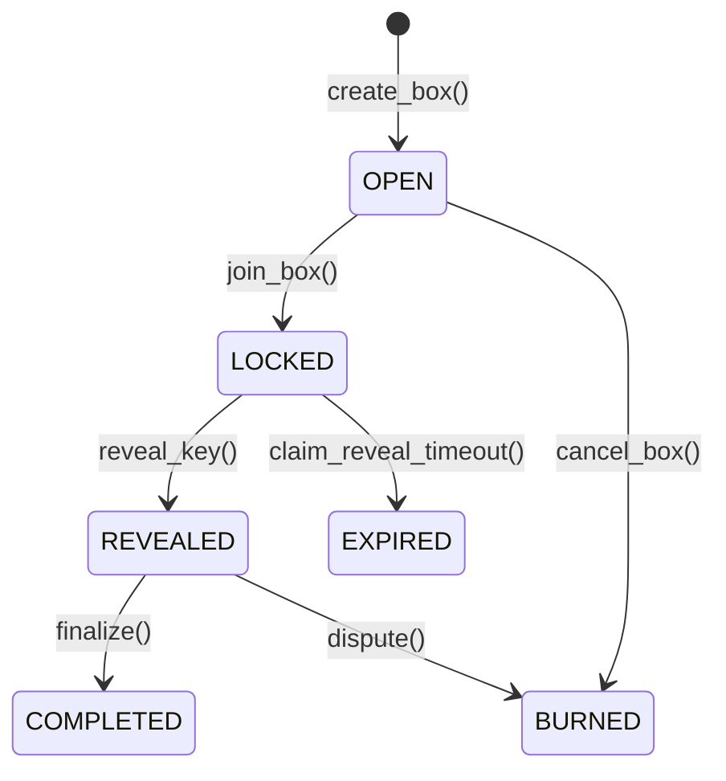

# 🔍 Analisi Completa del Progetto GiftBlitz

> **Data Analisi:** 8 Febbraio 2026  
> **Versione:** Production Build  
> **Network:** IOTA Testnet

---

## 📋 Executive Summary

**GiftBlitz** è una dApp decentralizzata che risolve il problema della fiducia nel trading P2P di gift card attraverso un sistema di **Double Trust Deposit** su blockchain IOTA. Il progetto implementa un meccanismo di game theory che rende la frode matematicamente irrazionale, eliminando la necessità di arbitri centralizzati.

### Punti di Forza Principali

✅ **Architettura Smart Contract Solida**: Implementazione Move ben strutturata con gestione degli stati robusta  
✅ **Meccanica di Game Theory Provata**: Sistema Trust Deposit asimmetrico (Buyer 110%, Seller 100%)  
✅ **Sistema di Reputazione Soulbound**: NFT non trasferibile che cresce con l'esperienza  
✅ **Frontend Moderno**: React + TypeScript + Tailwind con UX premium  
✅ **Integrazione IOTA**: Uso nativo di IOTA Tokenization e Smart Contracts Layer 1

### Aree di Attenzione

⚠️ **Scalabilità**: Necessità di ottimizzazione per volumi elevati  
⚠️ **Recovery Identity**: Sistema di sincronizzazione vault tra browser (risolto di recente)  
⚠️ **Mobile Wallet**: Supporto limitato a wallet desktop (TanglePay in valutazione)

---

## 🏗️ Architettura del Progetto

### Struttura Directory

```
GiftBlitzFull/
├── contracts/              # Smart contracts Move
│   ├── sources/
│   │   ├── giftblitz.move     # Logica escrow & trading
│   │   └── reputation.move    # Sistema reputazione NFT
│   ├── tests/
│   └── build/
├── fe/                     # Frontend React
│   ├── src/
│   │   ├── pages/             # 8 pagine principali
│   │   ├── components/        # 6 componenti riutilizzabili
│   │   ├── context/           # State management
│   │   ├── hooks/             # Custom React hooks
│   │   ├── utils/             # Utility functions
│   │   └── data/              # Mock data & contracts config
│   └── public/
├── Docs/                   # Documentazione completa
│   ├── 2_GiftBlitz_WhitePaper.md
│   ├── 5_GiftBlitz_GameTheory_Analysis.md
│   ├── 8_IOTA_Services_Integration.md
│   └── ...
├── iota-service/          # IOTA CLI binaries (.gitignore)
├── publish_testnet.sh     # Script deploy automatico
└── readme.md
```

---

## 🔐 Smart Contracts (Move)

### 1. `giftblitz.move` - Core Trading Logic

**Oggetti Principali:**

| Oggetto    | Tipo          | Scopo                               |
| ---------- | ------------- | ----------------------------------- |
| `GiftBox`  | Shared Object | Escrow per le transazioni P2P       |
| `Treasury` | Shared Object | Raccolta fee (1%) e fondi disputati |
| `AdminCap` | Owned Object  | Capability per operazioni admin     |

**Stati del GiftBox:**



**Funzioni Entry Point:**

```move
create_box()          // Seller crea Box con carta cifrata + trust deposit 100% Face Value
join_box()            // Buyer entra con payment + trust deposit 110% Face Value
reveal_key()          // Seller rivela chiave di decriptazione (entro 72h)
finalize()            // Buyer conferma trade (happy path)
dispute()             // Buyer disputa → BURN depositi (restituisce price al buyer)
claim_auto_finalize() // Auto-conferma dopo 72h da reveal
claim_reveal_timeout()// Buyer recupera fondi se seller non rivela entro 72h
cancel_box()          // Seller cancella box non joined
withdraw_fees()       // Admin preleva fee accumulate
```

**Meccanismo Trust Deposit:**

```
Esempio: Gift Card Amazon €100 venduta a €80

SELLER deposita:
  - Trust Deposit: 100% Face Value = €100

BUYER deposita:
  - Payment: €80
  - Trust Deposit: 110% Face Value = €110
  TOTALE: €190

SCENARIO HAPPY PATH:
  - Seller riceve: €80 (price) + €100 (deposit) - €0.80 (1% fee) = €179.20
  - Buyer riceve: €110 (deposit back) + carta €100 value

SCENARIO DISPUTE:
  - Buyer riceve: €80 (price refund)
  - Seller perde: €100 (deposit → Treasury)
  - Buyer perde: €110 (deposit → Treasury)
  - Treasury confisca: €210
```

**Perché è Anti-Frode:**

- Seller che froda perde €100 per guadagnare massimo €80 → **perdita netta €20**
- Buyer che fa false dispute perde €110 ma recupera solo €80 → **perdita netta €30**
- Frode = matematicamente irrazionale ✅

---

### 2. `reputation.move` - Sistema Soulbound NFT

**Struttura ReputationNFT:**

```move
public struct ReputationNFT has key {
    id: UID,
    owner: address,           // Non trasferibile
    public_key: vector<u8>,   // Chiave pubblica per encryption
    vault: vector<u8>,        // Hub Private Key cifrata (cross-browser sync)
    total_trades: u64,        // Conta trade completati
    total_volume: u64,        // Volume totale in nanoIOTA
    disputes: u64,            // Numero dispute (idealmente 0)
    first_trade_time: u64,    // Timestamp primo trade
}
```

**Trade Caps (Asimmetrici):**

| Ruolo      | Trade Count | Max Value |
| ---------- | ----------- | --------- |
| **SELLER** | 0+          | €200      |
| **BUYER**  | 0-2         | €30       |
| **BUYER**  | 3-6         | €50       |
| **BUYER**  | 7-14        | €100      |
| **BUYER**  | 15+         | €200      |

**Logica:**

- Seller ha già "skin in the game" (trust deposit 100%) → può vendere subito
- Buyer ha caps progressivi per prevenire **griefing attacks** (false dispute seriali)
- Una disputa resetta `total_trades` a 0 per entrambe le parti

**Funzioni Chiave:**

```move
mint_profile()              // Crea NFT soulbound per nuovo utente
update_stats()              // +1 trade dopo finalize
reset_on_dispute()          // Penalizza disputante
record_dispute_counterparty() // Penalizza controparte
update_vault()              // Aggiorna vault cifrata (recovery)
get_max_buy_value()         // Calcola cap buyer in base a trades
```

---

## 💻 Frontend (React + TypeScript)

### Stack Tecnologico

```json
{
  "framework": "Vite + React 19.2",
  "language": "TypeScript 5.9",
  "styling": "Tailwind CSS 3.4",
  "blockchain": "@iota/dapp-kit 0.8.3",
  "routing": "react-router-dom 7.13",
  "animations": "framer-motion 12.29",
  "state": "@tanstack/react-query 5.90"
}
```

### Pagine Principali

| File                 | Rotta        | Scopo                                             |
| -------------------- | ------------ | ------------------------------------------------- |
| `Home.tsx`           | `/`          | Landing page con value proposition                |
| `Market.tsx`         | `/market`    | Marketplace con lista GiftBox disponibili         |
| `CreateBox.tsx`      | `/create`    | Form per creare nuovo GiftBox                     |
| `PurchaseBox.tsx`    | `/buy/:id`   | Dettaglio box e acquisto                          |
| `TradeDetail.tsx`    | `/trade/:id` | Gestione trade attivo (reveal, finalize, dispute) |
| `Profile.tsx`        | `/profile`   | Dashboard utente con trade history                |
| `Wiki.tsx`           | `/wiki`      | Documentazione e FAQ                              |
| `AdminDashboard.tsx` | `/admin`     | Panel admin per Treasury management               |

### Componenti Chiave

**`BoxCard.tsx`** (16.7 KB)

- Rendering card gift box nel marketplace
- Visualizzazione stato (OPEN, LOCKED, REVEALED, COMPLETED)
- Badge reputazione seller
- Countdown per timeouts (72h reveal, 72h finalize)

**`SyncIdentityModal.tsx`**

- Recovery identity cross-browser
- Decryption vault cifrata on-chain
- Gestione chiavi private locali

**`Navbar.tsx`**

- Wallet connection (@iota/dapp-kit)
- Display balance e indirizzo
- Navigazione responsive

**`CountdownTimer.tsx`**

- Timer per 72h reveal/finalize timeout
- Visual alerts per urgenze

### Data Layer

**`fe/src/data/contracts.json`**

```json
{
  "NETWORK": "testnet",
  "PACKAGE_ID": "0x...",
  "ADMIN_CAP_ID": "0x...",
  "TREASURY_ID": "0x..."
}
```

Aggiornato automaticamente da `publish_testnet.sh`

**`fe/src/data/mockData.ts`** (11.8 KB)

- Brand gift card supportati (Amazon, Apple, Netflix, etc.)
- Esempi box per sviluppo
- Costanti (NANO_PER_IOTA, fee rates)

---

## 🔒 Sistema di Sicurezza

### Crittografia End-to-End


**Nessun Dato Sensibile On-Chain:**

- Solo `encrypted_code_hash` (SHA-256) pubblico
- `encrypted_code` cifrato con AES-256
- `encrypted_key` cifrato con RSA-2048 (Buyer Public Key)

### Timeouts di Sicurezza

| Evento                                  | Timeout | Azione                                                                            |
| --------------------------------------- | ------- | --------------------------------------------------------------------------------- |
| Seller non rivela dopo lock             | 72h     | Buyer può chiamare `claim_reveal_timeout()` → recupera tutto + 50% seller deposit |
| Buyer non finalizza/disputa dopo reveal | 72h     | Anyone può chiamare `claim_auto_finalize()` → fondi al seller                     |

---

## 🎮 Game Theory & Incentivi

### Matrice dei Payoff (Esempio: €100 card @ €80)

|                   | Buyer Honest                                       | Buyer False Dispute          |
| ----------------- | -------------------------------------------------- | ---------------------------- |
| **Seller Honest** | Seller: +€79.20<br>Buyer: +€20 value               | Seller: -€100<br>Buyer: -€30 |
| **Seller Cheats** | Seller: +€80 (se buyer non disputa)<br>Buyer: -€80 | Seller: -€100<br>Buyer: €0   |

**Nash Equilibrium:** (Seller Honest, Buyer Honest)

**Perché Funziona:**

1. **Seller Cheat Deterrence:**
   - Se seller truffa → buyer disputa (perché recupera price)
   - Seller perde €100 per tentare di rubare €80 → **perdita netta**

2. **Buyer Griefing Deterrence:**
   - False dispute costa €110 (buyer deposit)
   - Buyer recupera solo €80 (price) → **perdita netta €30**
   - Seller perde €100 → rapporto 3.3:1 (buyer perde più in proporzione)

3. **Trust Deposit Asimmetrico:**
   - Buyer 110% previene attacco "redeem then dispute"
   - Anche se buyer ruba codice, perde €110 per guadagnare €100 value → **perdita**

---

## 📊 Integrazione IOTA Hackathon

### Allineamento ai Requisiti

| Requisito                      | Implementazione                                     | Status |
| ------------------------------ | --------------------------------------------------- | ------ |
| **Real-world problem**         | P2P gift card trust (€23B/year lost globally)       | ✅     |
| **Built on IOTA L1**           | Move Smart Contracts su IOTA                        | ✅     |
| **IOTA Service: Tokenization** | GiftBox (shared object) + ReputationNFT (soulbound) | ✅     |

**Servizi IOTA Utilizzati:**

1. **Tokenization (L1):**
   - `GiftBox` come asset tokenizzato
   - `ReputationNFT` soulbound (on-chain identity proxy)

2. **Smart Contracts (Move):**
   - Escrow logic con stati
   - Capabilities pattern (`AdminCap`)
   - Events per audit trail

**Non Utilizzati (volutamente):**

- IOTA Identity (DID) → semplificato con custom NFT
- IOTA Hierarchies → non applicabile a P2P
- IOTA Trust Framework formale → gestito via game theory

---

## 🚀 Deployment & Operations

### Script di Deploy

**`publish_testnet.sh`** (2.4 KB)

```bash
# 1. Build contract
cd contracts
../iota-service/iota move build

# 2. Publish to testnet
TX_OUTPUT=$(../iota-service/iota client publish --gas-budget 500000000)

# 3. Extract IDs
PACKAGE_ID=$(echo "$TX_OUTPUT" | grep "Package ID" | cut -d: -f2)
ADMIN_CAP_ID=$(echo "$TX_OUTPUT" | grep "AdminCap" | cut -d: -f2)
TREASURY_ID=$(echo "$TX_OUTPUT" | grep "Treasury" | cut -d: -f2)

# 4. Update fe/src/data/contracts.json
cat > ../fe/src/data/contracts.json <<EOF
{
  "NETWORK": "testnet",
  "PACKAGE_ID": "$PACKAGE_ID",
  "ADMIN_CAP_ID": "$ADMIN_CAP_ID",
  "TREASURY_ID": "$TREASURY_ID"
}
EOF
```

**Processo Completo:**

```bash
# WSL
cd /mnt/c/path/to/GiftBlitzFull
bash publish_testnet.sh

# Verify Treasury ID (shared object)
./iota-service/iota client tx-block <DEPLOY_TX> --json | grep Treasury

# Build frontend
cd fe
npm run build

# Deploy to Vercel (presente vercel.json)
git push
```

---

## 📈 Metriche di Progetto

### Codebase

| Categoria                | Files   | Lines      |
| ------------------------ | ------- | ---------- |
| Smart Contracts (Move)   | 2       | ~540       |
| Frontend (React/TS)      | ~30     | ~5000+     |
| Documentation (Markdown) | 10      | ~3500      |
| **Total**                | **42+** | **~9000+** |

### Smart Contract Complexity

**`giftblitz.move`:**

- 448 lines
- 9 entry functions pubbliche
- 6 stati possibili
- 5 eventi emessi

**`reputation.move`:**

- 95 lines
- 3 entry functions
- 4 funzioni `package` visibility (chiamate solo da giftblitz)

### Frontend Components

- **8 Pages** (routing completo)
- **6 Reusable Components**
- **3 Context Providers** (wallet, identity, toast)
- **2 Custom Hooks**

---

## 🔍 Analisi Critica

### Punti di Forza

1. **✅ Solidità Matematica**
   - Sistema trust deposit ben calibrato
   - Game theory provata con matrici payoff
   - Nessun incentivo alla frode

2. **✅ Codice Move Pulito**
   - Naming chiaro e consistente
   - Gestione errori con assert espliciti
   - Pattern Move idiomatici (shared objects, capabilities)

3. **✅ UX Premium**
   - Design moderno dark mode
   - Animazioni smooth (framer-motion)
   - Countdown timer visibili per timeouts

4. **✅ Documentazione Completa**
   - WhitePaper dettagliato
   - Game Theory Analysis rigorosa
   - Guide deployment step-by-step

5. **✅ Security First**
   - Encryption end-to-end
   - Timeouts per prevenire deadlock
   - Soulbound NFT (no account trading)

### Aree di Miglioramento

1. **⚠️ Scalabilità Query**
   - Frontend usa query dirette ai box (no indexer)
   - Performance potenzialmente lenta con 1000+ box attivi
   - **Soluzione:** Implementare IOTA GraphQL indexer

2. **⚠️ Mobile Wallet Support**
   - Attualmente solo desktop wallet (IOTA Wallet browser extension)
   - TanglePay mobile in valutazione ma non integrato
   - **Impatto:** Limita adoption mobile-first users

---

## 🎯 Raccomandazioni

### Priorità Alta (Pre-Mainnet)

1. **Testing Rigoroso**
   - Unit test Move per tutti gli edge case
   - Integration test end-to-end (create → finalize/dispute)
   - Stress test con 100+ box concorrenti

2. **Audit Security**
   - Revisione Move code da esperti IOTA/Sui
   - Penetration test frontend (XSS, injection)
   - Verifica encryption implementation (AES-256, RSA-2048)

3. **Gas Optimization**
   - Ridurre storage on-chain ove possibile
   - Batch operations dove applicabile
   - Analisi costi per utente finale

### Priorità Media (Post-Launch)

4. **GraphQL Indexer**
   - Setup IOTA indexer personalizzato
   - Cache layer per marketplace query
   - Real-time events subscription

5. **Mobile Wallet**
   - Integrazione TanglePay SDK
   - WalletConnect v2 per altri wallet
   - Testing su iOS/Android

6. **Analytics Dashboard**
   - Metrics: volume giornaliero, dispute rate, avg trade size
   - User retention & churn analysis
   - Treasury balance tracking

### Priorità Bassa (Future)

7. **Advanced Features**
   - Multi-currency support (USD, EUR gift cards)
   - Batch trading (sell 10x €10 cards come bundle)
   - Escrow insurance pool (opzionale per utenti risk-averse)

8. **Governance**
   - DAO per gestione Treasury dispute funds
   - Community voting su fee rate (attualmente 1%)
   - Upgrade contract tramite upgrade capability

---

## 📝 Conclusioni

**GiftBlitz è un progetto tecnicamente solido con una proposta di valore chiara:**

- ✅ Risolve un problema reale (€23B waste globally)
- ✅ Architettura blockchain ben progettata (Move + IOTA L1)
- ✅ Meccanica anti-frode matematicamente provata
- ✅ UX/UI moderna e professionale
- ✅ Documentazione completa e rigorosa

**Il progetto è pronto per:**

- Testing su IOTA testnet (già deployed)
- User testing con early adopters
- Raccolta feedback su UX e trust mechanism

**Prima di mainnet:**

- Security audit obbligatorio
- Test copertura edge cases (timeouts, dispute simultanee, gas exhaustion)
- Ottimizzazione costi gas per micro-transazioni

**Potenziale:**

- **Short-term:** Catturare 0.1% mercato italiano (€1.5M volume → €15k revenue/anno)
- **Mid-term:** Espansione EU con supporto multi-lingua
- **Long-term:** Integration con issuer diretti (Amazon, Apple) per carte "verified"

---

## 🏆 Valutazione Finale

| Criterio             | Punteggio | Note                                                            |
| -------------------- | --------- | --------------------------------------------------------------- |
| **Solidità Tecnica** | 9/10      | Move implementation eccellente, alcune ottimizzazioni possibili |
| **Innovazione**      | 8/10      | Applicazione creativa di game theory a problema reale           |
| **UX/Design**        | 8/10      | UI moderna, potrebbe migliorare onboarding                      |
| **Sicurezza**        | 7/10      | Encryption solida, ma richiede audit professionale              |
| **Documentazione**   | 9/10      | WhitePaper e docs dettagliati, poche lacune                     |
| **Deployment Ready** | 7/10      | Testnet OK, mainnet richiede audit + testing                    |
| **Market Fit**       | 8/10      | Problema validato, execution da provare sul campo               |

**Overall: 8/10** - Progetto maturo e ben eseguito, pronto per fase di testing con utenti reali.

---

_Fine Analisi - Generata il 8 Febbraio 2026_
