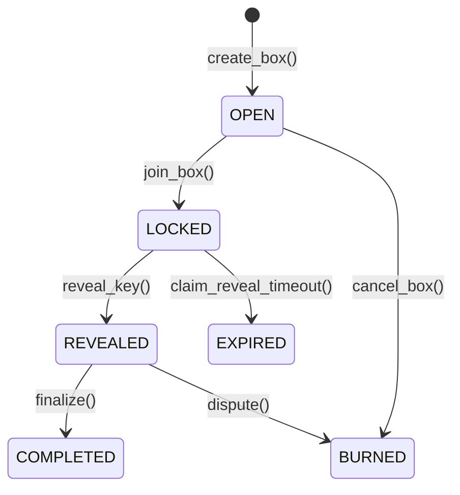
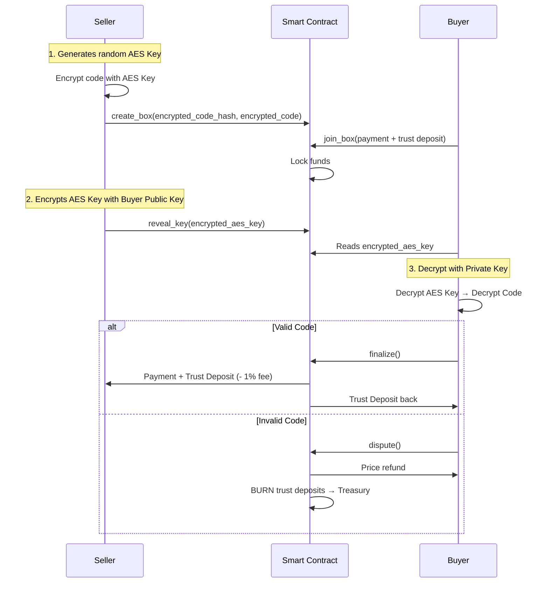

# 🔍 Complete Analysis of GiftBlitz Project

> **Analysis Date:** February 8, 2026
> **Version:** Production Build
> **Network:** IOTA Testnet

---

## 📋 Executive Summary

**GiftBlitz** is a decentralized dApp that solves the problem of trust in P2P gift card trading through a **Double Trust Deposit** system on the IOTA blockchain. The project implements a game theory mechanism that makes fraud mathematically irrational, eliminating the need for centralized arbitrators.

### Main Strengths

✅ **Solid Smart Contract Architecture**: Well-structured Move implementation with robust state management
✅ **Proven Game Theory Mechanics**: Asymmetric Trust Deposit system (Buyer 110%, Seller 100%)
✅ **Soulbound Reputation System**: Non-transferable NFT that grows with experience
✅ **Modern Frontend**: React + TypeScript + Tailwind with premium UX
✅ **IOTA Integration**: Native use of IOTA Tokenization and Layer 1 Smart Contracts

### Areas of Attention

⚠️ **Scalability**: Need for optimization for high volumes
⚠️ **Identity Recovery**: Vault synchronization system between browsers (recently resolved)
⚠️ **Mobile Wallet**: Support limited to desktop wallets (TanglePay under evaluation)

---

## 🏗️ Project Architecture

### Directory Structure

```
GiftBlitzFull/
├── contracts/              # Move Smart contracts
│   ├── sources/
│   │   ├── giftblitz.move     # Escrow & trading logic
│   │   └── reputation.move    # NFT Reputation system
│   ├── tests/
│   └── build/
├── fe/                     # React Frontend
│   ├── src/
│   │   ├── pages/             # 8 main pages
│   │   ├── components/        # 6 reusable components
│   │   ├── context/           # State management
│   │   ├── hooks/             # Custom React hooks
│   │   ├── utils/             # Utility functions
│   │   └── data/              # Mock data & contracts config
│   └── public/
├── Docs/                   # Complete documentation
│   ├── 2_GiftBlitz_WhitePaper.md
│   ├── 5_GiftBlitz_GameTheory_Analysis.md
│   ├── 8_IOTA_Services_Integration.md
│   └── ...
├── iota-service/          # IOTA CLI binaries (.gitignore)
├── publish_testnet.sh     # Automatic deploy script
└── readme.md
```

---

## 🔐 Smart Contracts (Move)

### 1. `giftblitz.move` - Core Trading Logic

**Main Objects:**

| Object     | Type          | Purpose                             |
| ---------- | ------------- | ----------------------------------- |
| `GiftBox`  | Shared Object | Escrow for P2P transactions         |
| `Treasury` | Shared Object | Collecting fees (1%) and disputed funds |
| `AdminCap` | Owned Object  | Capability for admin operations     |

**GiftBox States:**



**Entry Point Functions:**

```move
create_box()          // Seller creates Box with encrypted card + 100% Face Value trust deposit
join_box()            // Buyer joins with payment + 110% Face Value trust deposit
reveal_key()          // Seller reveals decryption key (within 72h)
finalize()            // Buyer confirms trade (happy path)
dispute()             // Buyer disputes → BURN deposits (refunds price to buyer)
claim_auto_finalize() // Auto-confirm after 72h from reveal
claim_reveal_timeout()// Buyer recovers funds if seller does not reveal within 72h
cancel_box()          // Seller cancels un-joined box
withdraw_fees()       // Admin withdraws accumulated fees
```

**Trust Deposit Mechanism:**

```
Example: Amazon Gift Card €100 sold at €80

SELLER deposits:
  - Trust Deposit: 100% Face Value = €100

BUYER deposits:
  - Payment: €80
  - Trust Deposit: 110% Face Value = €110
  TOTAL: €190

HAPPY PATH SCENARIO:
  - Seller receives: €80 (price) + €100 (deposit) - €0.80 (1% fee) = €179.20
  - Buyer receives: €110 (deposit back) + card €100 value

DISPUTE SCENARIO:
  - Buyer receives: €80 (price refund)
  - Seller loses: €100 (deposit → Treasury)
  - Buyer loses: €110 (deposit → Treasury)
  - Treasury confiscates: €210
```

**Why it is Anti-Fraud:**

- Seller who frauds loses €100 to gain maximum €80 → **net loss €20**
- Buyer who makes false disputes loses €110 but recovers only €80 → **net loss €30**
- Fraud = mathematically irrational ✅

---

### 2. `reputation.move` - Soulbound NFT System

**ReputationNFT Structure:**

```move
public struct ReputationNFT has key {
    id: UID,
    owner: address,           // Non-transferable
    public_key: vector<u8>,   // Public key for encryption
    vault: vector<u8>,        // Encrypted Hub Private Key (cross-browser sync)
    total_trades: u64,        // Counts completed trades
    total_volume: u64,        // Total volume in nanoIOTA
    disputes: u64,            // Number of disputes (ideally 0)
    first_trade_time: u64,    // First trade timestamp
}
```

**Trade Caps (Asymmetric):**

| Role       | Trade Count | Max Value |
| ---------- | ----------- | --------- |
| **SELLER** | 0+          | €200      |
| **BUYER**  | 0-2         | €30       |
| **BUYER**  | 3-6         | €50       |
| **BUYER**  | 7-14        | €100      |
| **BUYER**  | 15+         | €200      |

**Logic:**

- Seller already has "skin in the game" (100% trust deposit) → can sell immediately
- Buyer has progressive caps to prevent **griefing attacks** (serial false disputes)
- A dispute resets `total_trades` to 0 for both parties

**Key Functions:**

```move
mint_profile()              // Creates soulbound NFT for new user
update_stats()              // +1 trade after finalize
reset_on_dispute()          // Penalizes disputer
record_dispute_counterparty() // Penalizes counterparty
update_vault()              // Updates encrypted vault (recovery)
get_max_buy_value()         // Calculates buyer cap based on trades
```

---

## 💻 Frontend (React + TypeScript)

### Tech Stack

```json
{
  "framework": "Vite + React 19.2",
  "language": "TypeScript 5.9",
  "styling": "Tailwind CSS 3.4",
  "blockchain": "@iota/dapp-kit 0.8.3",
  "routing": "react-router-dom 7.13",
  "animations": "framer-motion 12.29",
  "state": "@tanstack/react-query 5.90"
}
```

### Main Pages

| File                 | Route        | Purpose                                           |
| -------------------- | ------------ | ------------------------------------------------- |
| `Home.tsx`           | `/`          | Landing page with value proposition               |
| `Market.tsx`         | `/market`    | Marketplace with list of available GiftBoxes      |
| `CreateBox.tsx`      | `/create`    | Form to create new GiftBox                        |
| `PurchaseBox.tsx`    | `/buy/:id`   | Box detail and purchase                           |
| `TradeDetail.tsx`    | `/trade/:id` | Active trade management (reveal, finalize, dispute) |
| `Profile.tsx`        | `/profile`   | User dashboard with trade history                 |
| `Wiki.tsx`           | `/wiki`      | Documentation and FAQ                             |
| `AdminDashboard.tsx` | `/admin`     | Admin panel for Treasury management               |

### Key Components

**`BoxCard.tsx`** (16.7 KB)

- Gift box card rendering in marketplace
- Status visualization (OPEN, LOCKED, REVEALED, COMPLETED)
- Seller reputation badge
- Countdown for timeouts (72h reveal, 72h finalize)

**`SyncIdentityModal.tsx`**

- Cross-browser identity recovery
- On-chain encrypted vault decryption
- Local private key management

**`Navbar.tsx`**

- Wallet connection (@iota/dapp-kit)
- Balance and address display
- Responsive navigation

**`CountdownTimer.tsx`**

- Timer for 72h reveal/finalize timeout
- Visual alerts for urgency

### Data Layer

**`fe/src/data/contracts.json`**

```json
{
  "NETWORK": "testnet",
  "PACKAGE_ID": "0x...",
  "ADMIN_CAP_ID": "0x...",
  "TREASURY_ID": "0x..."
}
```

Automatically updated by `publish_testnet.sh`

**`fe/src/data/mockData.ts`** (11.8 KB)

- Supported gift card brands (Amazon, Apple, Netflix, etc.)
- Box examples for development
- Constants (NANO_PER_IOTA, fee rates)

---

## 🔒 Security System

### End-to-End Encryption



**No Sensitive Data On-Chain:**

- Only `encrypted_code_hash` (SHA-256) public
- `encrypted_code` encrypted with AES-256
- `encrypted_key` encrypted with RSA-2048 (Buyer Public Key)

### Security Timeouts

| Event                                   | Timeout | Action                                                                            |
| --------------------------------------- | ------- | --------------------------------------------------------------------------------- |
| Seller does not reveal after lock       | 72h     | Buyer can call `claim_reveal_timeout()` → recovers everything + 50% seller deposit |
| Buyer does not finalize/dispute after reveal | 72h     | Anyone can call `claim_auto_finalize()` → funds to seller                         |

---

## 🎮 Game Theory & Incentives

### Payoff Matrix (Example: €100 card @ €80)

|                   | Buyer Honest                                       | Buyer False Dispute          |
| ----------------- | -------------------------------------------------- | ---------------------------- |
| **Seller Honest** | Seller: +€79.20<br>Buyer: +€20 value               | Seller: -€100<br>Buyer: -€30 |
| **Seller Cheats** | Seller: +€80 (if buyer doesn't dispute)<br>Buyer: -€80 | Seller: -€100<br>Buyer: €0   |

**Nash Equilibrium:** (Seller Honest, Buyer Honest)

**Why It Works:**

1. **Seller Cheat Deterrence:**
   - If seller scams → buyer disputes (because they recover price)
   - Seller loses €100 to try to steal €80 → **net loss**

2. **Buyer Griefing Deterrence:**
   - False dispute costs €110 (buyer deposit)
   - Buyer recovers only €80 (price) → **net loss €30**
   - Seller loses €100 → ratio 3.3:1 (buyer loses more proportionally)

3. **Asymmetric Trust Deposit:**
   - Buyer 110% prevents "redeem then dispute" attack
   - Even if buyer steals code, they lose €110 to gain €100 value → **loss**

---

## 📊 IOTA Hackathon Integration

### Alignment with Requirements

| Requirement                    | Implementation                                      | Status |
| ------------------------------ | --------------------------------------------------- | ------ |
| **Real-world problem**         | P2P gift card trust (€23B/year lost globally)       | ✅     |
| **Built on IOTA L1**           | Move Smart Contracts on IOTA                        | ✅     |
| **IOTA Service: Tokenization** | GiftBox (shared object) + ReputationNFT (soulbound) | ✅     |

**IOTA Services Used:**

1. **Tokenization (L1):**
   - `GiftBox` as tokenized asset
   - `ReputationNFT` soulbound (on-chain identity proxy)

2. **Smart Contracts (Move):**
   - Escrow logic with states
   - Capabilities pattern (`AdminCap`)
   - Events for audit trail

**Not Used (intentionally):**

- IOTA Identity (DID) → simplified with custom NFT
- IOTA Hierarchies → not applicable to P2P
- Formal IOTA Trust Framework → managed via game theory

---

## 🚀 Deployment & Operations

### Deploy Script

**`publish_testnet.sh`** (2.4 KB)

```bash
# 1. Build contract
cd contracts
../iota-service/iota move build

# 2. Publish to testnet
TX_OUTPUT=$(../iota-service/iota client publish --gas-budget 500000000)

# 3. Extract IDs
PACKAGE_ID=$(echo "$TX_OUTPUT" | grep "Package ID" | cut -d: -f2)
ADMIN_CAP_ID=$(echo "$TX_OUTPUT" | grep "AdminCap" | cut -d: -f2)
TREASURY_ID=$(echo "$TX_OUTPUT" | grep "Treasury" | cut -d: -f2)

# 4. Update fe/src/data/contracts.json
cat > ../fe/src/data/contracts.json <<EOF
{
  "NETWORK": "testnet",
  "PACKAGE_ID": "$PACKAGE_ID",
  "ADMIN_CAP_ID": "$ADMIN_CAP_ID",
  "TREASURY_ID": "$TREASURY_ID"
}
EOF
```

**Complete Process:**

```bash
# WSL
cd /mnt/c/path/to/GiftBlitzFull
bash publish_testnet.sh

# Verify Treasury ID (shared object)
./iota-service/iota client tx-block <DEPLOY_TX> --json | grep Treasury

# Build frontend
cd fe
npm run build

# Deploy to Vercel (vercel.json present)
git push
```

---

## 📈 Project Metrics

### Codebase

| Category                 | Files   | Lines      |
| ------------------------ | ------- | ---------- |
| Smart Contracts (Move)   | 2       | ~540       |
| Frontend (React/TS)      | ~30     | ~5000+     |
| Documentation (Markdown) | 10      | ~3500      |
| **Total**                | **42+** | **~9000+** |

### Smart Contract Complexity

**`giftblitz.move`:**

- 448 lines
- 9 public entry functions
- 6 possible states
- 5 events emitted

**`reputation.move`:**

- 95 lines
- 3 entry functions
- 4 `package` visibility functions (called only by giftblitz)

### Frontend Components

- **8 Pages** (full routing)
- **6 Reusable Components**
- **3 Context Providers** (wallet, identity, toast)
- **2 Custom Hooks**

---

## 🔍 Critical Analysis

### Strengths

1. **✅ Mathematical Solidity**
   - Well-calibrated trust deposit system
   - Proven game theory with payoff matrices
   - No incentive for fraud

2. **✅ Clean Move Code**
   - Clear and consistent naming
   - Error handling with explicit asserts
   - Idiomatic Move patterns (shared objects, capabilities)

3. **✅ Premium UX**
   - Modern dark mode design
   - Smooth animations (framer-motion)
   - Visible countdown timers for timeouts

4. **✅ Complete Documentation**
   - Detailed WhitePaper
   - Rigorous Game Theory Analysis
   - Step-by-step deployment guides

5. **✅ Security First**
   - End-to-end encryption
   - Timeouts to prevent deadlocks
   - Soulbound NFT (no account trading)

### Areas for Improvement

1. **⚠️ Query Scalability**
   - Frontend uses direct box queries (no indexer)
   - Potentially slow performance with 1000+ active boxes
   - **Solution:** Implement IOTA GraphQL indexer

2. **⚠️ Mobile Wallet Support**
   - Currently only desktop wallet (IOTA Wallet browser extension)
   - TanglePay mobile under evaluation but not integrated
   - **Impact:** Limits adoption by mobile-first users

---

## 🎯 Recommendations

### High Priority (Pre-Mainnet)

1. **Rigorous Testing**
   - Move unit tests for all edge cases
   - End-to-end integration tests (create → finalize/dispute)
   - Stress test with 100+ concurrent boxes

2. **Security Audit**
   - Move code review by IOTA/Sui experts
   - Frontend penetration test (XSS, injection)
   - Encryption implementation verification (AES-256, RSA-2048)

3. **Gas Optimization**
   - Reduce on-chain storage where possible
   - Batch operations where applicable
   - Cost analysis for end user

### Medium Priority (Post-Launch)

4. **GraphQL Indexer**
   - Custom IOTA indexer setup
   - Cache layer for marketplace query
   - Real-time events subscription

5. **Mobile Wallet**
   - TanglePay SDK integration
   - WalletConnect v2 for other wallets
   - Testing on iOS/Android

6. **Analytics Dashboard**
   - Metrics: daily volume, dispute rate, avg trade size
   - User retention & churn analysis
   - Treasury balance tracking

### Low Priority (Future)

7. **Advanced Features**
   - Multi-currency support (USD, EUR gift cards)
   - Batch trading (sell 10x €10 cards as bundle)
   - Escrow insurance pool (optional for risk-averse users)

8. **Governance**
   - DAO for Treasury dispute funds management
   - Community voting on fee rate (currently 1%)
   - Contract upgrade via upgrade capability

---

## 📝 Conclusions

**GiftBlitz is a technically solid project with a clear value proposition:**

- ✅ Solves a real problem (€23B waste globally)
- ✅ Well-designed blockchain architecture (Move + IOTA L1)
- ✅ Mathematically proven anti-fraud mechanism
- ✅ Modern and professional UX/UI
- ✅ Complete and rigorous documentation

**The project is ready for:**

- Testing on IOTA testnet (already deployed)
- User testing with early adopters
- Feedback collection on UX and trust mechanism

**Before mainnet:**

- Mandatory security audit
- Edge cases coverage test (timeouts, simultaneous disputes, gas exhaustion)
- Gas cost optimization for micro-transactions

**Potential:**

- **Short-term:** Capture 0.1% Italian market (€1.5M volume → €15k revenue/year)
- **Mid-term:** EU expansion with multi-language support
- **Long-term:** Integration with direct issuers (Amazon, Apple) for "verified" cards

---

## 🏆 Final Evaluation

| Criterion            | Score     | Notes                                                           |
| -------------------- | --------- | --------------------------------------------------------------- |
| **Technical Solidity**| 9/10      | Excellent Move implementation, some optimizations possible      |
| **Innovation**       | 8/10      | Creative application of game theory to real problem             |
| **UX/Design**        | 8/10      | Modern UI, onboarding could be improved                         |
| **Security**         | 7/10      | Solid encryption, but requires professional audit               |
| **Documentation**    | 9/10      | Detailed WhitePaper and docs, few gaps                          |
| **Deployment Ready** | 7/10      | Testnet OK, mainnet requires audit + testing                    |
| **Market Fit**       | 8/10      | Validated problem, execution to be proven in the field          |

**Overall: 8/10** - Mature and well-executed project, ready for testing phase with real users.

---

_End of Analysis - Generated on February 8, 2026_
