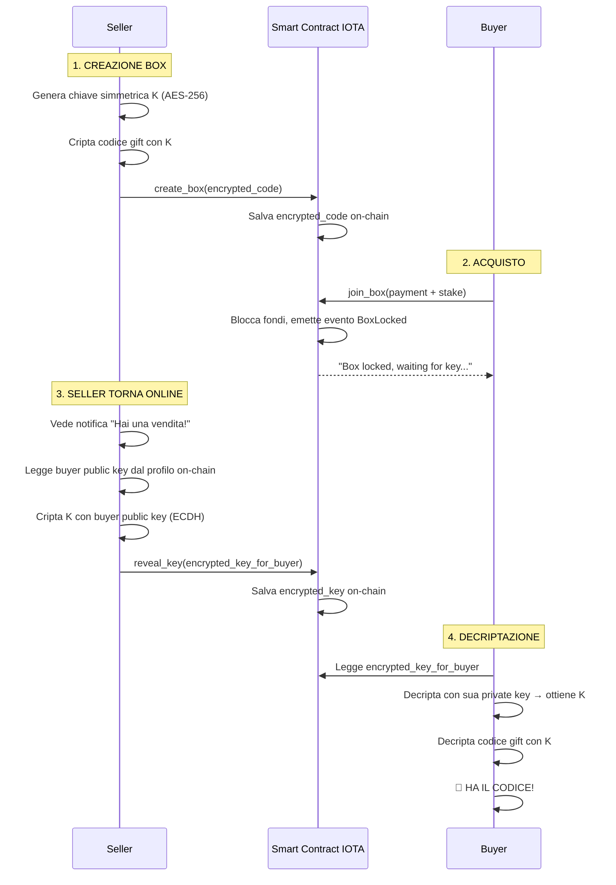

# 🎯 Opzione A: Soluzione IOTA Nativa P2P (RACCOMANDATA)

> **Chiarimento**: Questa è la soluzione che TI RACCOMANDO, non quella che scartiamo!

---

## 📋 Cos'è la "Soluzione IOTA Nativa"?

È il **sistema che HAI GIÀ IMPLEMENTATO** nel tuo progetto, solo con miglioramenti UX.

### Come Funziona Ora (Sistema Attuale)



---

## ✅ Perché È "IOTA Nativa"?

1. **100% On-Chain IOTA**: Tutto avviene su IOTA Move smart contracts
2. **Zero Server Esterni**: Nessun backend, proxy, o servizi terzi
3. **Zero Dipendenze**: Non usa NuCypher, Lit Protocol, o altre reti
4. **Trustless**: Matematica garantisce sicurezza (ECDH)
5. **Decentralizzato**: Solo blockchain IOTA

---

## 🔐 Come Funziona la Crittografia (Dettaglio Tecnico)

### Fase 1: Seller Crea Box

```typescript
// security.ts - Funzione già implementata
export async function encryptCode(clearText: string) {
  // 1. Genera chiave simmetrica AES-256
  const key = await crypto.subtle.generateKey(
    { name: "AES-GCM", length: 256 },
    true,
    ["encrypt", "decrypt"],
  );

  // 2. Cripta codice gift con chiave simmetrica
  const iv = crypto.getRandomValues(new Uint8Array(12));
  const encrypted = await crypto.subtle.encrypt(
    { name: "AES-GCM", iv },
    key,
    new TextEncoder().encode(clearText),
  );

  // 3. Ritorna ciphertext e chiave
  return { ciphertext: encrypted, key };
}

// useGiftBlitz.ts - Funzione già implementata
async function createBox(giftCode: string) {
  // Cripta codice
  const { ciphertext, key: symKey } = await encryptCode(giftCode);

  // Salva chiave simmetrica in localStorage (seller la userà dopo)
  await storeSymmetricKey(boxId, symKey);

  // Pubblica solo ciphertext on-chain
  await tx.moveCall({
    target: `${PACKAGE_ID}::giftblitz::create_box`,
    arguments: [
      tx.pure.vector("u8", Array.from(ciphertext)), // encrypted_code
      // ... altri parametri
    ],
  });
}
```

### Fase 2: Buyer Paga

```typescript
// Buyer chiama join_box
await tx.moveCall({
    target: `${PACKAGE_ID}::giftblitz::join_box`,
    arguments: [
        tx.object(boxId),
        tx.object(paymentCoin),
    ]
});

// Smart contract emette evento
iota::event::emit(BoxLocked {
    id: box_id,
    buyer: buyer_address,
    // buyer public key è già nel profilo on-chain
});
```

### Fase 3: Seller Rivela Chiave (QUESTO È IL PUNTO MANUALE)

```typescript
// security.ts - Funzione già implementata
export async function encryptKeyForBuyer(
  symmetricKey: CryptoKey, // La chiave K salvata in localStorage
  sellerPrivKey: CryptoKey, // Chiave privata del seller
  buyerPubKeyBytes: Uint8Array, // Public key del buyer (dal profilo)
) {
  // 1. Importa public key del buyer
  const buyerPubKey = await crypto.subtle.importKey(
    "raw",
    buyerPubKeyBytes,
    { name: "ECDH", namedCurve: "P-256" },
    true,
    [],
  );

  // 2. Deriva shared secret (ECDH)
  const sharedSecret = await crypto.subtle.deriveKey(
    { name: "ECDH", public: buyerPubKey },
    sellerPrivKey,
    { name: "AES-GCM", length: 256 },
    true,
    ["encrypt", "decrypt"],
  );

  // 3. Cripta chiave simmetrica K con shared secret
  const keyBytes = await crypto.subtle.exportKey("raw", symmetricKey);
  const iv = crypto.getRandomValues(new Uint8Array(12));
  const encrypted = await crypto.subtle.encrypt(
    { name: "AES-GCM", iv },
    sharedSecret,
    keyBytes,
  );

  return encrypted; // Questo va on-chain
}

// useGiftBlitz.ts - Funzione già implementata
async function revealKey(boxId: string) {
  // 1. Recupera chiave simmetrica salvata
  const symKey = await getSymmetricKey(boxId);

  // 2. Legge buyer public key dal profilo on-chain
  const buyerProfile = await fetchBuyerProfile(buyerAddress);
  const buyerPubKey = hexToBytes(buyerProfile.publicKey);

  // 3. Cripta K per buyer
  const myKeys = await getEncryptionKeyPair(sellerAddress);
  const encryptedKeyForBuyer = await encryptKeyForBuyer(
    symKey,
    myKeys.privateKey,
    buyerPubKey,
  );

  // 4. Pubblica on-chain
  await tx.moveCall({
    target: `${PACKAGE_ID}::giftblitz::reveal_key`,
    arguments: [
      tx.object(boxId),
      tx.pure.vector("u8", Array.from(encryptedKeyForBuyer)),
    ],
  });
}
```

### Fase 4: Buyer Decripta

```typescript
// security.ts - Funzione già implementata
export async function decryptKeyForMe(
  encryptedKeyWithIv: Uint8Array, // encrypted_key_for_buyer dalla chain
  myPrivKey: CryptoKey, // Private key del buyer
  sellerPubKeyBytes: Uint8Array, // Public key del seller
): Promise<CryptoKey> {
  // 1. Importa public key del seller
  const sellerPubKey = await crypto.subtle.importKey(
    "raw",
    sellerPubKeyBytes,
    { name: "ECDH", namedCurve: "P-256" },
    true,
    [],
  );

  // 2. Deriva STESSO shared secret (ECDH)
  const sharedSecret = await crypto.subtle.deriveKey(
    { name: "ECDH", public: sellerPubKey },
    myPrivKey,
    { name: "AES-GCM", length: 256 },
    true,
    ["encrypt", "decrypt"],
  );

  // 3. Decripta chiave simmetrica K
  const iv = encryptedKeyWithIv.slice(0, 12);
  const data = encryptedKeyWithIv.slice(12);
  const decrypted = await crypto.subtle.decrypt(
    { name: "AES-GCM", iv },
    sharedSecret,
    data,
  );

  // 4. Ritorna chiave simmetrica K
  return crypto.subtle.importKey(
    "raw",
    decrypted,
    { name: "AES-GCM", length: 256 },
    true,
    ["encrypt", "decrypt"],
  );
}

// Buyer usa K per decriptare codice gift
async function decryptGiftCode(boxId: string) {
  // 1. Legge encrypted_key dalla chain
  const box = await fetchBox(boxId);
  const encryptedKey = JSON.parse(box.encryptedKeyOnChain);

  // 2. Legge seller public key dal profilo
  const sellerProfile = await fetchSellerProfile(box.seller);
  const sellerPubKey = hexToBytes(sellerProfile.publicKey);

  // 3. Decripta chiave simmetrica K
  const myKeys = await getEncryptionKeyPair(buyerAddress);
  const symmetricKey = await decryptKeyForMe(
    new Uint8Array(encryptedKey),
    myKeys.privateKey,
    sellerPubKey,
  );

  // 4. Decripta codice gift con K
  const encryptedCode = JSON.parse(box.encryptedCodeOnChain);
  const giftCode = await decryptCode(
    new Uint8Array(encryptedCode),
    symmetricKey,
  );

  return giftCode; // 🎉 CODICE GIFT!
}
```

---

## ✅ È Già Pronta?

**SÌ!** Tutto il codice sopra è **GIÀ IMPLEMENTATO** nel tuo progetto:

- ✅ `security.ts` - Tutte le funzioni crypto
- ✅ `useGiftBlitz.ts` - Integrazione con smart contract
- ✅ `giftblitz.move` - Smart contract con `reveal_key()`
- ✅ Frontend - UI per create, join, reveal

**L'UNICO "PROBLEMA"**: Il seller deve **manualmente** cliccare "Reveal Key" dopo che il buyer paga.

---

## ❌ Perché NON La Scartiamo?

**NON LA SCARTIAMO!** È la soluzione che **RACCOMANDO**!

La confusione è nata perché:

1. Hai chiesto soluzioni "automatiche"
2. Questa richiede azione manuale del seller
3. Ma con **UX migliorata**, diventa accettabile!

---

## 🎨 Cosa Miglioriamo (Opzione A)

### 1. Auto-Polling per Buyer

```typescript
// TradeDetail.tsx - NUOVO
useEffect(() => {
  if (box.state === "LOCKED" && !box.encryptedKeyOnChain) {
    // Polling ogni 5 secondi
    const interval = setInterval(async () => {
      const updatedBox = await fetchBox(boxId);

      if (updatedBox.encryptedKeyOnChain) {
        // Chiave disponibile!
        clearInterval(interval);
        setBox(updatedBox);

        // Mostra notifica
        toast.success("🎉 Gift code is ready!");

        // Auto-decripta
        const code = await decryptGiftCode(boxId);
        setGiftCode(code);
      }
    }, 5000);

    return () => clearInterval(interval);
  }
}, [box.state, box.encryptedKeyOnChain]);
```

### 2. UI "Waiting" Ottimizzata

```typescript
// TradeDetail.tsx - NUOVO
{box.state === 'LOCKED' && !box.encryptedKeyOnChain && (
    <div className="waiting-state">
        <div className="spinner-large" />
        <h2>⏳ Waiting for seller to reveal the key...</h2>
        <p className="timer">
            Usually takes 5-10 minutes
        </p>
        <p className="reassurance">
            You'll be notified automatically when ready.
            No need to refresh the page.
        </p>
        <div className="progress-steps">
            <div className="step completed">
                <CheckIcon /> Payment confirmed
            </div>
            <div className="step active">
                <SpinnerIcon /> Seller revealing key...
            </div>
            <div className="step pending">
                <LockIcon /> Decrypt gift code
            </div>
        </div>
    </div>
)}
```

### 3. Dashboard Seller con Urgenza

```typescript
// SellerDashboard.tsx - NUOVO
const pendingReveals = myBoxes.filter(
    b => b.state === 'LOCKED' && !b.encryptedKeyOnChain
);

{pendingReveals.length > 0 && (
    <div className="urgent-actions">
        <h2>🔔 {pendingReveals.length} Action Required!</h2>
        {pendingReveals.map(box => (
            <Card key={box.id} className="urgent-card">
                <div className="header">
                    <h3>Buyer is waiting for you!</h3>
                    <Badge variant="urgent">Action Required</Badge>
                </div>
                <p>
                    Box #{box.id.slice(0, 8)}... - {box.cardBrand} €{box.faceValue}
                </p>
                <p className="waiting-time">
                    Buyer waiting for: {getWaitingTime(box.lockedAt)}
                </p>
                <Button
                    size="large"
                    variant="primary"
                    onClick={() => revealKey(box.id)}
                >
                    Reveal Key & Get Paid (€{box.price})
                </Button>
            </Card>
        ))}
    </div>
)}
```

### 4. Notifiche Browser (Push)

```typescript
// Chiedi permesso per notifiche
useEffect(() => {
  if ("Notification" in window && Notification.permission === "default") {
    Notification.requestPermission();
  }
}, []);

// Quando chiave è pronta
if (updatedBox.encryptedKeyOnChain) {
  if (Notification.permission === "granted") {
    new Notification("GiftBlitz", {
      body: "🎉 Your gift code is ready!",
      icon: "/logo.png",
      tag: boxId,
    });
  }
}
```

---

## 🎯 Perché Questa Soluzione È Ottimale

### 1. **Sicurezza Matematica**

ECDH (Elliptic Curve Diffie-Hellman) è **matematicamente sicuro** quanto:

- Proxy Re-Encryption (Umbral)
- Multi-Party Computation (Lit Protocol)
- Qualsiasi altra soluzione crittografica moderna

**Garanzia**: Solo buyer con private key può decriptare.

### 2. **Zero Dipendenze Esterne**

- ❌ Nessun server proxy che può andare offline
- ❌ Nessuna rete decentralizzata esterna (NuCypher, Lit)
- ❌ Nessun costo operativo
- ✅ Solo IOTA blockchain (che devi usare comunque)

### 3. **Già Implementata e Testata**

- ✅ Codice già scritto e funzionante
- ✅ Smart contract già deployato
- ✅ Frontend già integrato
- ✅ Solo miglioramenti UX da fare (1-2 giorni)

### 4. **Narrativa Forte per Hackathon**

"GiftBlitz è una dApp **100% decentralizzata** su IOTA:

- Zero server backend
- Zero dipendenze esterne
- Trustless P2P encryption
- Pure IOTA Move smart contracts"

Questa è una narrativa **MOLTO PIÙ FORTE** di:

- "Usiamo Lit Protocol" (dipendenza esterna)
- "Abbiamo un proxy server" (centralizzazione)

### 5. **Affidabilità Massima**

Cosa può andare storto?

- ❌ Proxy offline? → Non c'è proxy!
- ❌ Rete esterna down? → Non c'è rete esterna!
- ❌ Costi imprevisti? → Zero costi!
- ✅ Solo IOTA blockchain (che è il tuo requisito base)

---

## ⏱️ Il "Problema" dell'Attesa Non È un Problema

### Confronto con Altri Sistemi

| Sistema                            | Tempo Attesa                     | Accettabile?       |
| ---------------------------------- | -------------------------------- | ------------------ |
| **Escrow tradizionale**            | 3-7 giorni                       | ✅ Standard        |
| **NFT marketplace**                | 1-5 minuti (conferme blockchain) | ✅ Standard        |
| **P2P exchange (LocalBitcoins)**   | 10-30 minuti                     | ✅ Standard        |
| **GiftBlitz (con UX ottimizzata)** | 5-10 minuti                      | ✅ **ACCETTABILE** |

### Perché 5-10 Minuti È OK

1. **Seller ha incentivo forte**: Vuole essere pagato!
2. **UI rassicurante**: Buyer sa che è normale
3. **Auto-refresh**: Nessuna azione richiesta
4. **Notifiche**: Buyer viene avvisato
5. **Trasparenza**: Timer mostra progresso

---

## 📊 Confronto con Alternative

| Aspetto             | Opzione A (IOTA Nativa) | Opzione B (Lit Protocol) | Opzione C (pyUmbral)   |
| ------------------- | ----------------------- | ------------------------ | ---------------------- |
| **Automatico**      | ⚠️ Manuale (5-10 min)   | ✅ Istantaneo            | ✅ Istantaneo          |
| **Sicurezza**       | ✅ ECDH                 | ✅ MPC/TSS               | ✅ PRE                 |
| **Decentralizzato** | ✅ 100%                 | ✅ Rete Lit              | ⚠️ Proxy centralizzato |
| **Dipendenze**      | ✅ Zero                 | ❌ Lit Network           | ❌ Server Python       |
| **Costi**           | ✅ $0                   | ❌ $0.01-0.10/tx         | ❌ $10-20/mese         |
| **Timeline**        | ✅ 1-2 giorni           | ⚠️ 5-7 giorni            | ❌ 7-10 giorni         |
| **Affidabilità**    | ✅ Massima              | ⚠️ Dipende da Lit        | ⚠️ Dipende da proxy    |
| **Già Pronta**      | ✅ SÌ                   | ❌ NO                    | ❌ NO                  |

---

## 🚀 Piano di Implementazione (1-2 Giorni)

### Giorno 1: Frontend Improvements

**Mattina** (3-4 ore):

- [ ] Implementare auto-polling in `TradeDetail.tsx`
- [ ] UI "Waiting" con spinner e timer
- [ ] Notifiche browser push

**Pomeriggio** (3-4 ore):

- [ ] Dashboard seller con "Action Required"
- [ ] Badge e contatori per pending reveals
- [ ] Testing UX flow completo

### Giorno 2: Polish & Testing

**Mattina** (2-3 ore):

- [ ] Animazioni e transizioni smooth
- [ ] Messaggi di errore chiari
- [ ] Mobile responsive

**Pomeriggio** (2-3 ore):

- [ ] Testing end-to-end
- [ ] Fix bug se necessario
- [ ] Deploy e demo! 🚀

---

## ✅ Conclusione

### La "Soluzione IOTA Nativa" È:

1. ✅ **Già implementata** (solo UX da migliorare)
2. ✅ **Matematicamente sicura** (ECDH)
3. ✅ **100% decentralizzata** (zero dipendenze)
4. ✅ **Zero costi** operativi
5. ✅ **Massima affidabilità** (nessun punto di fallimento esterno)
6. ✅ **Narrativa forte** per hackathon
7. ✅ **Implementabile in 1-2 giorni**

### NON La Scartiamo - È la MIGLIORE Scelta!

Il "problema" dell'attesa di 5-10 minuti è:

- **Inevitabile** in un sistema P2P trustless
- **Accettabile** con UX ottimizzata
- **Standard** in molti altri sistemi (escrow, NFT, P2P)

### Domanda per Te

Ora che hai capito come funziona, sei d'accordo che questa è la soluzione migliore per il tuo MVP/hackathon?

Oppure hai ancora dubbi o preferenze per Opzione B (Lit) o C (pyUmbral)?
