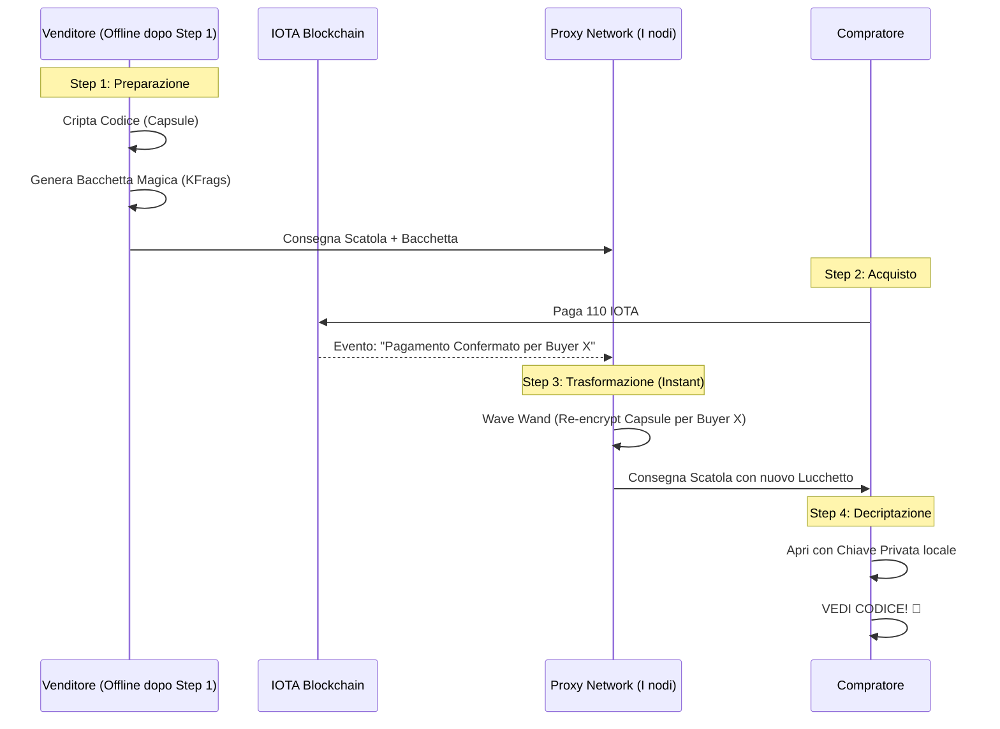

# 🎨 Visual Guide: How Proxy Re-Encryption Works

Proxy Re-Encryption (PRE) is like **"Magic Transformation Crittografica"**. Permette di cambiare il destinatario di un segreto senza mai doverlo leggere.

## 1. L'Analogia della "Scatola Magica"

Immagina questa situazione:

1.  **Il Venditore** mette il codice Amazon in una **scatola d'acciaio** e la chiude con il suo lucchetto (Chiave del Venditore).
2.  Il Venditore dà la scatola a un **Corriere (il Proxy)**.
3.  Il Venditore dà al Corriere anche una **Bacchetta Magica (Re-encryption Key)**.
    - _Nota_: La bacchetta **NON** può aprire la scatola. Può solo cambiarne la forma esterna.
4.  Il Venditore va in vacanza e spegne il telefono.
5.  **Il Compratore** arriva, paga sulla blockchain, e mostra la ricevuta al Corriere.
6.  Il Corriere usa la **Bacchetta Magica** sulla scatola chiusa.
7.  **Magia!** Il lucchetto sulla scatola si trasforma: ora non risponde più alla chiave del Venditore, ma si apre con la **Chiave del Compratore**.
8.  Il Compratore apre la scatola e legge il codice.

---

## 2. Il Flusso Tecnico (Mermaid Diagram)

Ecco come i dati si spostano tra il tuo browser, la rete e la blockchain:

---

## 3. Perché è "Professionale"?

| Problema      | Soluzione PRE                                                                                                            |
| :------------ | :----------------------------------------------------------------------------------------------------------------------- |
| **Privacy**   | I nodi (Proxy) non possono mai vedere il codice. Vedono solo "rumore" matematico.                                        |
| **Velocità**  | Il compratore non deve aspettare che il venditore torni online. La rete lavora per lui.                                  |
| **Sicurezza** | Anche se un nodo proxy viene hackerato, l'hacker non può leggere nulla perché ha solo un pezzo della "bacchetta magica". |

---

## 4. Visual Representation

_(L'immagine qui sopra mostra visivamente come il "lucchetto" cambia forma durante il passaggio dal venditore al compratore)_
